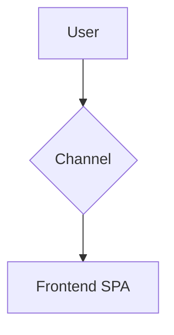
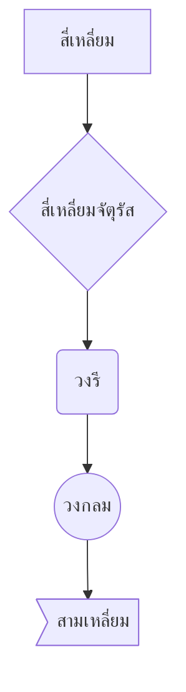
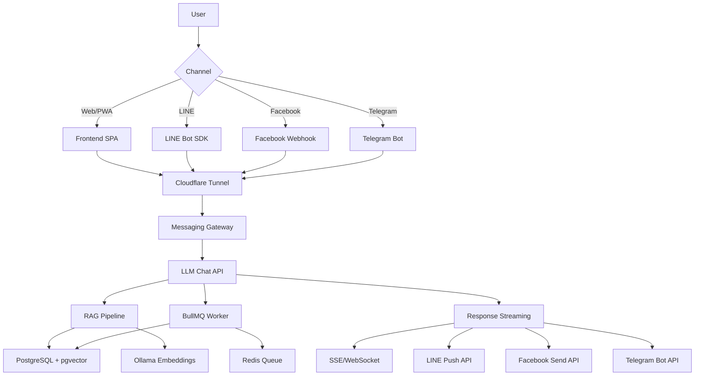
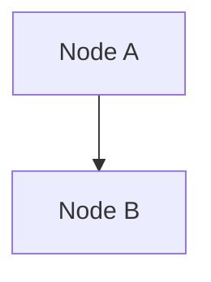
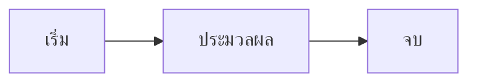
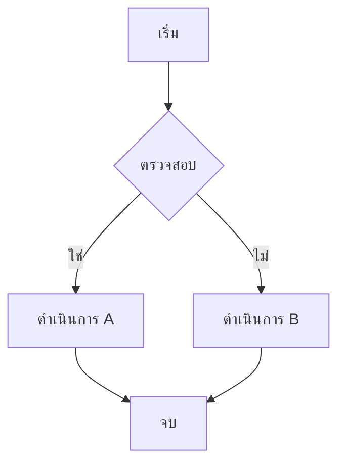
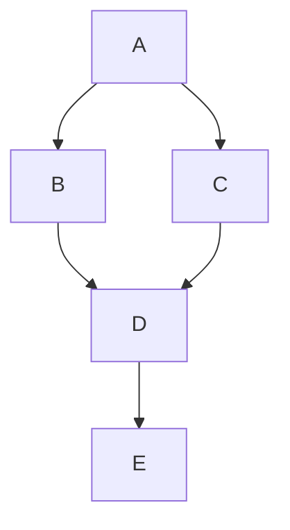

# Begin User Journey: Technical Stack Flow Step-by-Step to End

> **Technical Flow Documentation**: Complete user journey from first contact to final response, mapped to system components and data flow. Updated for current production state (November 2025).

---

## 📋 Tech Stack Overview (ภาพรวมเทคโนโลยีที่ใช้)

### Frontend Layer (เลเยอร์หน้าบ้าน)

#### 1. **Vite** (Build Tool & Dev Server)
- **หน้าที่**: เครื่องมือสำหรับ build และพัฒนา Single Page Application (SPA)
- **เหตุผลที่ใช้**: 
  - Build time เร็วมาก (ใช้ esbuild ภายใน)
  - Hot Module Replacement (HMR) แบบ instant
  - รองรับ ES modules แบบ native
  - โครงสร้างไฟล์ชัดเจน แยก `src/`, `public/`, `dist/`
- **การทำงาน**: 
  - Development: รัน dev server พร้อม HMR
  - Production: Build เป็น static files ไปยัง `dist/` folder
- **ไฟล์สำคัญ**: `vite.config.js`, `package.json`

#### 2. **Vanilla JavaScript** (ES6+)
- **หน้าที่**: ภาษาหลักสำหรับพัฒนา frontend logic
- **เหตุผลที่ใช้**: 
  - ไม่ต้องการ framework หนัก (React/Vue)
  - ขนาด bundle เล็ก
  - Performance ดี (ไม่มี overhead จาก framework)
- **โครงสร้างโค้ด**:
  - `src/js/api.js`: จัดการ API calls และ authentication
  - `src/js/router.js`: Client-side routing แบบ hash-based (`#/login`, `#/chat`)
  - `src/js/chat.js`: Logic สำหรับแชท interface
  - `src/js/ui.js`: UI components และ event handlers
- **คุณสมบัติที่ใช้**: 
  - ES6 modules (`import`/`export`)
  - Async/await สำหรับ API calls
  - EventSource API สำหรับ SSE

#### 3. **Bootstrap 5** (UI Framework)
- **หน้าที่**: CSS framework สำหรับสร้าง UI component
- **เหตุผลที่ใช้**: 
  - Component พร้อมใช้ (Modal, Dropdown, Badge, Table)
  - Responsive design built-in
  - Customization ง่าย (SASS variables)
- **การใช้งาน**: 
  - Layout: Grid system, Container
  - Components: Modal (login), Table (admin), Badge (status)
  - Utilities: Spacing, Colors, Typography

#### 4. **jQuery** (DOM Manipulation)
- **หน้าที่**: Library สำหรับจัดการ DOM และ AJAX
- **เหตุผลที่ใช้**: 
  - Bootstrap 5 ต้องการ jQuery สำหรับบาง components
  - Syntax สั้น ใช้งานง่าย (`$('#id')`)
  - AJAX helper functions (`$.ajax()`, `$.get()`)
- **การใช้งาน**: 
  - DOM queries และ manipulation
  - Event binding (`$(element).on('click', handler)`)
  - Template loading (`$('#container').load('template.html')`)

#### 5. **Nginx** (Web Server - Production)
- **หน้าที่**: Web server สำหรับ serve static files และ proxy API requests
- **เหตุผลที่ใช้**: 
  - Performance ดี (C10K problem)
  - Reverse proxy ไปยัง backend API
  - Static file caching
  - SPA routing support
- **การทำงาน**: 
  - Serve static files จาก `/usr/share/nginx/html`
  - Proxy `/api/*` ไปยัง `http://llm-chat-api:3000`
  - SPA fallback: ทุก route → `/index.html`
- **ไฟล์**: `nginx.conf`

### Backend Layer (เลเยอร์หลังบ้าน)

#### 6. **Node.js** (Runtime Environment)
- **หน้าที่**: JavaScript runtime สำหรับรัน backend code
- **เหตุผลที่ใช้**: 
  - ใช้ภาษาเดียวกับ frontend (JavaScript)
  - Event-driven, non-blocking I/O
  - Ecosystem ใหญ่ (npm packages)
- **เวอร์ชัน**: Node.js 20 LTS

#### 7. **Express 5** (Web Framework)
- **หน้าที่**: Web framework สำหรับสร้าง RESTful API
- **เหตุผลที่ใช้**: 
  - Minimalist และ flexible
  - Middleware ecosystem ใหญ่
  - Routing ง่าย (`app.get()`, `app.post()`)
- **การทำงาน**: 
  - Route handlers: `GET /api/chat`, `POST /api/auth/login`
  - Middleware chain: CORS → JSON parser → Auth → Controller
  - Error handling: Global error handler
- **ไฟล์**: `src/app.js`, `src/routes/*.js`

#### 8. **Sequelize** (ORM - Object-Relational Mapping)
- **หน้าที่**: ORM สำหรับทำงานกับ PostgreSQL database
- **เหตุผลที่ใช้**: 
  - Abstract SQL queries เป็น JavaScript objects
  - Migrations สำหรับ schema changes
  - Model relationships (associations)
- **การทำงาน**: 
  - Models: `User`, `Business`, `ChatSession`, `ChatMessage`
  - Queries: `User.findOne()`, `Business.findAll()`
  - Migrations: `migrations/*.js` สำหรับสร้าง/แก้ไข tables
- **ไฟล์**: `src/models/*.js`, `migrations/*.js`

#### 9. **PostgreSQL** (Relational Database)
- **หน้าที่**: เก็บข้อมูลทั้งหมดของระบบ (users, businesses, chat history)
- **เหตุผลที่ใช้**: 
  - ACID compliance (transaction safety)
  - JSON support
  - Extensions (pgvector สำหรับ vector search)
- **ข้อมูลที่เก็บ**: 
  - `users`: ข้อมูลผู้ใช้ (email, password hash, role)
  - `businesses`: ข้อมูลธุรกิจ (name, description, embedding vector)
  - `chat_sessions`: การสนทนา (title, user_id)
  - `chat_messages`: ข้อความในแต่ละ session
  - `business_packages`: แพ็กเกจที่ธุรกิจใช้
  - `payment_slips`: สลิปการชำระเงิน
- **Configuration**: Connection string `DATABASE_URL`

#### 10. **pgvector** (PostgreSQL Extension)
- **หน้าที่**: Extension สำหรับเก็บและค้นหา vector embeddings
- **เหตุผลที่ใช้**: 
  - เก็บ embedding vectors ในฐานข้อมูล (1536 dimensions)
  - ค้นหาความคล้ายคลึงแบบ cosine similarity
  - Index สำหรับความเร็ว (`CREATE INDEX USING ivfflat`)
- **การทำงาน**: 
  - เก็บ vector เป็น `vector(1536)` data type
  - Query: `SELECT * FROM businesses WHERE embedding <=> query_embedding`
  - ผลลัพธ์เรียงตาม similarity (น้อยสุด = คล้ายสุด)

#### 11. **Redis** (In-Memory Data Store)
- **หน้าที่**: Cache และ message queue backend
- **เหตุผลที่ใช้**: 
  - ความเร็วสูง (in-memory)
  - รองรับ pub/sub pattern
  - Data structures หลากหลาย (list, set, hash)
- **การใช้งาน**: 
  - BullMQ queue backend: เก็บ job data
  - Session store (optional): เก็บ temporary session data
  - Cache (future): เก็บคำตอบที่ใช้บ่อย

#### 12. **BullMQ** (Job Queue)
- **หน้าที่**: ระบบจัดการ background jobs (async tasks)
- **เหตุผลที่ใช้**: 
  - Job scheduling และ retry logic
  - Priority queues
  - Job monitoring dashboard
- **การทำงาน**: 
  - **Queue**: `embeddings` queue สำหรับ embedding jobs
  - **Jobs**: `embed-business` job type
  - **Worker**: Process jobs จาก queue
  - **Retry**: 5 attempts พร้อม exponential backoff
- **Configuration**: 
  - Connection: Redis URL
  - Concurrency: จำนวน jobs ที่ process พร้อมกัน
  - Remove on complete/fail: เก็บ history 50 jobs

### AI Layer (เลเยอร์ปัญญาประดิษฐ์)

#### 13. **Ollama** (Local LLM)
- **หน้าที่**: รัน Large Language Model แบบ local (Llama 3.2)
- **เหตุผลที่ใช้**: 
  - ฟรี ไม่มี API costs
  - ข้อมูลไม่ออกนอกเซิร์ฟเวอร์ (privacy)
  - รองรับ offline operation
- **การทำงาน**: 
  - Model: `llama3.2` (7B parameters)
  - API: `POST /api/generate` สำหรับ generate text
  - Embedding API: `POST /embeddings` สำหรับสร้าง vectors
- **Configuration**: 
  - Port: 11400 (generate), 11434 (embeddings)
  - URL: `http://llm-chat-embedder:11400`

#### 14. **RAG Pipeline** (Retrieval-Augmented Generation)
- **หน้าที่**: ระบบค้นหาข้อมูลที่เกี่ยวข้องก่อนส่งไป LLM
- **เหตุผลที่ใช้**: 
  - ลด hallucination (AI ตอบผิด)
  - ใช้ข้อมูลจริงจากฐานข้อมูล
  - ควบคุม output ให้ตรงกับข้อมูลธุรกิจ
- **การทำงาน**: 
  1. **Query Embedding**: แปลงคำถามเป็น vector
  2. **Vector Search**: ค้นหา businesses ที่คล้ายคลึง (pgvector)
  3. **Context Building**: รวมข้อมูลธุรกิจที่เกี่ยวข้อง
  4. **Prompt Assembly**: รวม context + prompt → final prompt
  5. **LLM Generation**: ส่งไป LLM พร้อม context

### Messaging Layer (เลเยอร์การส่งข้อความ)

#### 15. **LINE Bot SDK** (`@line/bot-sdk`)
- **หน้าที่**: SDK สำหรับทำงานกับ LINE Messaging API
- **เหตุผลที่ใช้**: 
  - Official SDK จาก LINE
  - Signature verification built-in
  - Message types ครบ (text, image, location, etc.)
- **การทำงาน**: 
  - **Webhook Middleware**: ตรวจสอบ signature อัตโนมัติ
  - **Reply API**: ส่งข้อความตอบกลับ (`replyMessage()`)
  - **Push API**: ส่งข้อความโดยไม่ต้อง reply (`pushMessage()`)
- **Configuration**: 
  - Channel Secret: สำหรับ signature verification
  - Channel Access Token: สำหรับ API calls

#### 16. **Messaging Gateway** (Custom Service)
- **หน้าที่**: Service สำหรับเชื่อมต่อ messaging platforms กับ backend
- **เหตุผลที่ใช้**: 
  - แยก messaging logic ออกจาก main API
  - รองรับหลาย platforms (LINE, Facebook, Telegram)
  - Normalize messages เป็นรูปแบบมาตรฐาน
- **การทำงาน**: 
  - **Inbound**: รับ webhook จาก platforms → normalize → ส่งไป backend
  - **Outbound**: รับคำตอบจาก backend → format → ส่งกลับ platform
  - **Session Mapping**: เชื่อม external user ID กับ internal session ID
- **ไฟล์**: `messaging-gateway/src/index.js`, `messageRouter.js`

### Infrastructure Layer (เลเยอร์โครงสร้างพื้นฐาน)

#### 17. **Docker & Docker Compose**
- **หน้าที่**: Containerization และ orchestration
- **เหตุผลที่ใช้**: 
  - Isolation: แต่ละ service ทำงานแยกกัน
  - Consistency: เดียวกันทั้ง dev และ prod
  - Easy deployment: `docker compose up -d`
- **การทำงาน**: 
  - **Services**: 8 containers (frontend, pwa, api, worker, messaging-gateway, postgres, redis, embedder)
  - **Networks**: `llm-chat-network` สำหรับ inter-service communication
  - **Volumes**: `vit_postgres_data` สำหรับเก็บข้อมูล database
- **ไฟล์**: `docker-compose.prod.yml`, `docker-compose.dev.yml`

#### 18. **Cloudflare Tunnel**
- **หน้าที่**: Secure tunnel สำหรับ expose local services ไปยัง internet
- **เหตุผลที่ใช้**: 
  - ไม่ต้องเปิด port บน firewall
  - HTTPS encryption อัตโนมัติ
  - DDoS protection จาก Cloudflare
- **การทำงาน**: 
  - **Tunnels**: 4 tunnels (frontend, api, pwa, webhooks)
  - **Routes**: Map public domain → internal service
  - **Example**: `frontend.sri-ketguide.com` → `vit-llm-chat-frontend-1:80`
- **Configuration**: Token-based authentication

#### 19. **BullMQ Dashboard** (Job Monitoring)
- **หน้าที่**: Web UI สำหรับ monitoring job queues
- **การทำงาน**: 
  - แสดงจำนวน jobs (waiting, active, completed, failed)
  - Job details (data, attempts, errors)
  - Job retry และ cleanup

---

## Overview: System Components

> **ภาพรวมส่วนประกอบระบบ**: แผนภาพแสดงสถาปัตยกรรมทั้งหมดของระบบ LLM Chat RAG ซึ่งประกอบด้วยช่องทางการเข้าถึงต่างๆ และส่วนประกอบหลักในการประมวลผลข้อมูล

### 📊 **แผนภาพ Mermaid คืออะไร?**

**Mermaid** เป็นเครื่องมือสำหรับสร้างแผนภาพด้วยโค้ด (diagrams as code) โดยใช้ syntax แบบ Markdown

**ข้อดี**:
- ✅ เขียนด้วย text syntax ง่ายๆ (ไม่ต้องใช้ GUI)
- ✅ แก้ไขได้ง่าย (เหมือนแก้ไขโค้ด)
- ✅ รองรับ version control (Git)
- ✅ แสดงผลอัตโนมัติใน Markdown viewers (GitHub, GitLab, VS Code, etc.)
- ✅ สร้าง Flowcharts, Sequence Diagrams, Gantt Charts, และอื่นๆ ได้

**เว็บไซต์**: https://mermaid.js.org/

### 🔧 **วิธีการสร้างแผนภาพ Mermaid**

#### **1. Syntax พื้นฐาน**



**คำอธิบาย**:
- `graph TB`: กำหนดประเภทแผนภาพและทิศทาง
  - `graph`: แผนภาพแบบ flow (flowchart)
  - `TB`: Top to Bottom (จากบนลงล่าง)
  - อื่นๆ: `LR` (Left to Right), `BT` (Bottom to Top), `RL` (Right to Left)
- `A[User]`: สร้าง node ชื่อ `A` พร้อม label `User`
  - `A`: ID ของ node (ใช้สำหรับอ้างอิง)
  - `[User]`: Label ที่แสดง (ใช้ `[]` สำหรับสี่เหลี่ยม, `{}` สำหรับสี่เหลี่ยมจัตุรัส, `()` สำหรับวงรี)
- `A --> B`: ลูกศรเชื่อมจาก A ไป B
  - `-->`: ลูกศรธรรมดา
  - `-.-`: เส้นประ
  - `==>`: ลูกศรหนา
- `B -->|Label| C`: ลูกศรพร้อม label
  - `|Web/PWA|`: ข้อความที่แสดงบนลูกศร

#### **2. ประเภทของ Node Shapes**



**Syntax**:
- `[Text]`: สี่เหลี่ยม (Rectangle)
- `{Text}`: สี่เหลี่ยมจัตุรัส (Diamond) - มักใช้สำหรับ decision point
- `(Text)`: วงรี (Round edges)
- `((Text))`: วงกลม (Circle)
- `>Text]`: สามเหลี่ยม (Parallelogram)

#### **3. แผนภาพที่ใช้ในเอกสารนี้**



**คำอธิบายโครงสร้าง**:
1. **Entry Point**: `A[User]` → ผู้ใช้เริ่มต้น
2. **Channel Selection**: `B{Channel}` → เลือกช่องทาง (Web/PWA, LINE, Facebook, Telegram)
3. **Frontend Layer**: `C`, `D`, `E`, `F` → หน้าต่างผู้ใช้แต่ละช่องทาง
4. **Network Layer**: `G[Cloudflare Tunnel]` → การเชื่อมต่อแบบปลอดภัย
5. **Integration Layer**: `H[Messaging Gateway]` → แปลงข้อความเป็นรูปแบบมาตรฐาน
6. **Core API**: `I[LLM Chat API]` → ระบบหลักประมวลผล
7. **RAG Processing**: `J[RAG Pipeline]` → ค้นหาข้อมูลที่เกี่ยวข้อง
8. **Data Storage**: `K[PostgreSQL]`, `L[Ollama]` → เก็บข้อมูลและสร้าง embeddings
9. **Background Jobs**: `M[BullMQ Worker]`, `N[Redis Queue]` → งานเบื้องหลัง
10. **Response Layer**: `O[Response Streaming]` → ส่งคำตอบกลับ
11. **Output Channels**: `P`, `Q`, `R`, `S` → ส่งคำตอบผ่านช่องทางต่างๆ

#### **4. วิธีการแก้ไข/สร้างแผนภาพ**

**ใน Markdown file**:
```markdown

```

**วิธีแก้ไข**:
1. เปิดไฟล์ `.md` ด้วย text editor หรือ Markdown viewer
2. แก้ไขโค้ด Mermaid ภายใน block ```mermaid ... ```
3. บันทึกไฟล์
4. ดูผลลัพธ์ใน Markdown viewer (VS Code, GitHub, GitLab, etc.)

**ตัวอย่างการเพิ่ม node**:
```mermaid
graph TB
    A[User] --> B{Channel}
    B -->|Web/PWA| C[Frontend SPA]
    B -->|LINE| D[LINE Bot SDK]
    B -->|New Channel| X[New Service]  # เพิ่ม node ใหม่
    X --> G[Cloudflare Tunnel]         # เชื่อมต่อกับ node อื่น
```

#### **5. เครื่องมือสำหรับสร้าง/ดูแผนภาพ**

**Online Editors**:
- **Mermaid Live Editor**: https://mermaid.live/
  - แก้ไขโค้ดและดูผลลัพธ์แบบ real-time
  - Export เป็น PNG, SVG
- **GitHub/GitLab**: แสดงผลอัตโนมัติเมื่อ commit โค้ด

**VS Code Extensions**:
- **Markdown Preview Mermaid Support**: ดูแผนภาพใน VS Code preview
- **Mermaid Preview**: แสดงผล preview แยกหน้าต่าง

**Command Line**:
```bash
# ติดตั้ง Mermaid CLI
npm install -g @mermaid-js/mermaid-cli

# แปลง .mmd เป็น PNG
mmdc -i diagram.mmd -o diagram.png
```

#### **6. Tips สำหรับสร้างแผนภาพที่ดี**

✅ **Best Practices**:
- ใช้ชื่อ node ที่สั้นและชัดเจน (`A`, `B`, `C`)
- ใช้ label ที่เข้าใจง่าย (`[Frontend SPA]` แทน `[FS]`)
- จัดระเบียบ flow จากบนลงล่าง (`TB`) หรือซ้ายไปขวา (`LR`)
- ใช้ `{}` สำหรับ decision points
- ใช้ `|Label|` กับลูกศรเพื่ออธิบายเงื่อนไข

❌ **สิ่งที่ควรหลีกเลี่ยง**:
- อย่าใช้ชื่อ node ยาวเกินไป
- อย่าสร้างแผนภาพซับซ้อนเกินไป (แบ่งเป็นหลายแผนภาพ)
- อย่าลืมปิด block ```mermaid``` ด้วย ```

### 📝 **ตัวอย่างการสร้างแผนภาพใหม่**

**ตัวอย่าง 1: Simple Flow**


**ตัวอย่าง 2: Decision Flow**


**ตัวอย่าง 3: Multiple Connections**


---

**หมายเหตุ**: แผนภาพด้านล่างแสดงสถาปัตยกรรมของระบบ LLM Chat RAG ที่อธิบายข้างต้น


### คำอธิบายส่วนประกอบหลักอย่างละเอียด:

#### **ช่องทางการเข้าถึง (Entry Channels)**

**1. Web/PWA (Single Page Application)**
- **URL**: `https://frontend.sri-ketguide.com` หรือ `https://pwa.sri-ketguide.com`
- **หน้าที่**: 
  - เป็น interface หลักสำหรับผู้ใช้ทั่วไป
  - แสดงหน้าเว็บแบบ SPA (ไม่ต้อง refresh หน้า)
  - รองรับ offline mode สำหรับ PWA
- **การทำงาน**:
  - โหลด JavaScript bundle จาก Nginx
  - Client-side routing ด้วย hash-based URLs (`#/login`, `#/chat`)
  - API calls ไปยัง backend ผ่าน `/api/*` proxy
  - SSE connection สำหรับรับคำตอบแบบ streaming
- **เทคโนโลยี**: Vite + Vanilla JS + Bootstrap 5 + Nginx
- **Container**: `llm-chat-frontend` (port 80), `llm-chat-pwa` (port 80)

**2. LINE Official Account**
- **ID**: @61582704027978
- **หน้าที่**: 
  - เชื่อมต่อกับผู้ใช้ผ่าน LINE app
  - รับและส่งข้อความผ่าน LINE Messaging API
- **การทำงาน**:
  - ผู้ใช้เพิ่มเพื่อน LINE → ส่งข้อความ
  - LINE ส่ง webhook event มาที่ `https://webhooks.sri-ketguide.com/line/webhook`
  - Messaging Gateway ตรวจสอบ signature และ process
  - ส่งคำตอบกลับผ่าน LINE Bot SDK
- **เทคโนโลยี**: LINE Bot SDK + Webhook + Signature Verification
- **Container**: `messaging-gateway` (port 8080)

**3. Facebook Messenger**
- **สถานะ**: พร้อมใช้งานแต่ยังไม่ได้เปิดใช้งานจริง
- **หน้าที่**: เชื่อมต่อกับผู้ใช้ผ่าน Facebook Messenger
- **การทำงาน**: คล้ายกับ LINE แต่ใช้ Facebook Graph API
- **เทคโนโลยี**: Facebook Graph API + Webhook

**4. Telegram Bot**
- **สถานะ**: เตรียมพร้อมใช้งาน
- **หน้าที่**: เชื่อมต่อกับผู้ใช้ผ่าน Telegram Bot
- **การทำงาน**: คล้ายกับ LINE แต่ใช้ Telegram Bot API
- **เทคโนโลยี**: Telegram Bot API + Webhook

#### **Cloudflare Tunnel (Network Layer)**

**หน้าที่หลัก**:
- **Secure Ingress**: เชื่อมต่ออินเทอร์เน็ตกับ Docker services ภายใน
- **HTTPS Termination**: แปลง HTTPS เป็น HTTP ภายใน
- **DDoS Protection**: ป้องกันการโจมตีจาก Cloudflare edge network

**การทำงาน**:
- **Tunnel Container**: `cf-tunnel-prod`, `cf-tunnel-api`, `cf-tunnel-frontend`, `cf-tunnel-webhooks`
- **Connection**: Tunnel agent เชื่อมต่อไปยัง Cloudflare edge network
- **Routing**: Cloudflare Zero Trust จัดการ routes
  - `frontend.sri-ketguide.com` → `vit-llm-chat-frontend-1:80`
  - `api.sri-ketguide.com` → `vit-llm-chat-api-1:3000`
  - `pwa.sri-ketguide.com` → `vit-llm-chat-pwa-1:80`
  - `webhooks.sri-ketguide.com` → `messaging-gateway:8080`

**ข้อดี**:
- ไม่ต้องเปิด port 5555, 3000, 8080 บน firewall
- TLS encryption อัตโนมัติ (Let's Encrypt)
- IP filtering และ access control
- Analytics และ monitoring จาก Cloudflare

#### **Messaging Gateway (Integration Layer)**

**หน้าที่หลัก**:
- **Message Normalization**: แปลงข้อความจาก platforms ต่างๆ เป็นรูปแบบมาตรฐาน
- **Session Management**: จัดการ session สำหรับ external users (LINE, Facebook, Telegram)
- **Routing**: ส่งข้อความไปยัง backend และรับคำตอบกลับ

**การทำงาน**:
1. **Inbound Flow**:
   - รับ webhook จาก platform (LINE/Facebook/Telegram)
   - ตรวจสอบ signature (HMAC verification)
   - Normalize message format: `{ platform, externalUserId, text, metadata }`
   - ส่งไปยัง backend API: `POST /api/internal/messaging-gateway`

2. **Outbound Flow**:
   - รับคำตอบจาก backend
   - Format ตาม platform (LINE: text message, Facebook: JSON API, etc.)
   - ส่งกลับไปยัง platform ผ่าน SDK/API

**Session Mapping**:
- **External User ID**: LINE userId, Facebook PSID, Telegram chatId
- **Internal Session ID**: UUID จาก ChatSession table
- **Storage**: In-memory store (sessionStore.js) สำหรับ mapping

**เทคโนโลยี**: Express + LINE Bot SDK + Axios
**Container**: `messaging-gateway` (port 8080)

#### **LLM Chat API (Core Business Logic)**

**หน้าที่หลัก**:
- **Authentication**: ตรวจสอบ JWT token และจัดการ user sessions
- **Chat Processing**: รับคำถาม → เรียก RAG → เรียก LLM → ส่งคำตอบ
- **Data Management**: CRUD operations สำหรับ businesses, users, packages
- **Background Jobs**: จัดการ embedding jobs ผ่าน BullMQ

**API Endpoints หลัก**:
- `POST /api/auth/login`: ล็อกอินผู้ใช้
- `POST /api/chat`: ส่งคำถามและรับคำตอบ
- `GET /api/chat/stream`: SSE streaming สำหรับคำตอบ
- `GET /api/chat/history`: ดึงประวัติการสนทนา
- `GET /api/businesses`: จัดการข้อมูลธุรกิจ
- `GET /api/embeddings/stats`: สถิติ embedding jobs
- `POST /api/internal/messaging-gateway`: Internal endpoint สำหรับ gateway

**การทำงาน**:
1. **Request Reception**: Express route handler
2. **Authentication**: JWT middleware ตรวจสอบ token
3. **Business Logic**: Controller จัดการ request
4. **Database Access**: Sequelize ORM query PostgreSQL
5. **AI Processing**: เรียก RAG pipeline → LLM
6. **Response**: ส่งกลับ JSON หรือ SSE stream

**เทคโนโลยี**: Express 5 + Sequelize + JWT + BullMQ
**Container**: `llm-chat-api` (port 3000)

#### **RAG Pipeline (Retrieval-Augmented Generation)**

**หน้าที่หลัก**:
- **Vector Search**: ค้นหาธุรกิจที่เกี่ยวข้องกับคำถามโดยใช้ embedding similarity
- **Context Building**: รวมข้อมูลธุรกิจที่เกี่ยวข้องเป็นบริบท
- **Prompt Engineering**: รวม system prompt + context + user question

**การทำงานขั้นตอนละเอียด**:

1. **Query Embedding**:
   - รับคำถามของผู้ใช้ (text)
   - ส่งไปยัง Ollama Embedding API: `POST http://llm-chat-embedder:11400/embeddings`
   - ได้ผลลัพธ์: vector 1536 dimensions
   - เวลา: ~100-300ms

2. **Vector Search**:
   - Query PostgreSQL ด้วย pgvector:
   ```sql
   SELECT id, name, description,
          1 - (embedding <=> $1::vector) as similarity
   FROM businesses
   WHERE embedding IS NOT NULL
   ORDER BY similarity DESC
   LIMIT 10;
   ```
   - ผลลัพธ์: Top 10 businesses ที่คล้ายคลึงที่สุด
   - เวลา: ~20-100ms (ขึ้นกับ index)

3. **Business Filtering**:
   - กรองตาม package tier (Premium → Standard → Free)
   - กรองตาม is_active = true
   - จำกัดจำนวน: สูงสุด 50 businesses

4. **Context Assembly**:
   - รวมข้อมูลธุรกิจ: `name + description`
   - รวมรูปภาพ: ``
   - รูปแบบ: Markdown

5. **Prompt Building**:
   - System Prompt: จาก `persona-prompts.js`
   - Context: ข้อมูลธุรกิจที่เกี่ยวข้อง
   - History: ประวัติการสนทนา 10 รายการล่าสุด
   - User Question: คำถามปัจจุบัน

**เทคโนโลยี**: Ollama + pgvector + PostgreSQL
**Performance**: <200ms รวม (embedding + search)

#### **BullMQ Worker (Background Job Processor)**

**หน้าที่หลัก**:
- **Embedding Generation**: สร้าง embedding vectors สำหรับธุรกิจใหม่/อัปเดต
- **Job Processing**: Process jobs จาก queue แบบ async
- **Retry Logic**: Retry เมื่อ job fail พร้อม exponential backoff
- **Status Tracking**: อัปเดต `embedding_status` ใน database

**การทำงาน**:

1. **Job Enqueue**:
   - Trigger: เมื่อสร้างหรือแก้ไข business
   - Debounce: 5 วินาที (ป้องกัน duplicate jobs)
   - Job ID: `embed:<businessId>` (idempotent)
   - Queue: `embeddings` queue ใน Redis

2. **Worker Process**:
   - Worker pull job จาก queue
   - อัปเดต status: `pending` → `processing`
   - สร้าง embedding: เรียก Ollama API
   - บันทึกผลลัพธ์: อัปเดต `businesses.embedding` column

3. **Error Handling**:
   - Retry: 5 attempts
   - Backoff: Exponential (1s, 2s, 4s, 8s, 16s)
   - On fail: อัปเดต status เป็น `failed`
   - Logging: บันทึก error ใน `embedding_events` table

**เทคโนโลยี**: BullMQ + Redis + Node.js Worker
**Container**: `llm-chat-worker` (ไม่มี port, internal only)

#### **Response Streaming (Real-time Communication)**

**หน้าที่หลัก**:
- **Streaming Response**: ส่งคำตอบแบบ real-time ไม่ต้องรอให้เสร็จทั้งหมด
- **Multiple Channels**: รองรับ SSE (web), LINE API, Facebook API, Telegram API

**การทำงาน**:

**1. Server-Sent Events (SSE)**:
- **Connection**: `EventSource` จาก frontend → `/api/chat/stream`
- **Headers**: `Content-Type: text/event-stream`, `Cache-Control: no-cache`
- **Data Format**: 
  ```
  data: {"type":"chunk","content":"คำตอบส่วนแรก","sessionId":"..."}
  
  data: {"type":"chunk","content":"คำตอบส่วนที่สอง","sessionId":"..."}
  ```
- **Frontend Processing**: 
  ```javascript
  eventSource.onmessage = (event) => {
    const data = JSON.parse(event.data);
    appendToChat(data.content);
  };
  ```

**2. LINE Push/Reply**:
- **Reply**: เมื่อมี replyToken (ตอบกลับข้อความที่เพิ่งได้รับ)
- **Push**: เมื่อไม่มี replyToken (ส่งข้อความใหม่)
- **Format**: LINE Bot SDK format
- **Limit**: 2000 characters per message

**3. Facebook Send API**:
- **Format**: Facebook Graph API JSON
- **Endpoint**: `POST https://graph.facebook.com/v17.0/{page-id}/messages`

**เทคโนโลยี**: SSE (Express), LINE Bot SDK, Axios (Facebook/Telegram)

---

## 1. User Entry Point (Authentication Layer)

> **จุดเริ่มต้นของผู้ใช้**: ส่วนที่จัดการการเข้าสู่ระบบและการตรวจสอบตัวตน ซึ่งเป็นประตูแรกที่ผู้ใช้ต้องผ่านก่อนเข้าสู่ระบบแชท

### 1.1 Web/PWA Login Flow

> **กระบวนการล็อกอินผ่านเว็บหรือ PWA**: เมื่อผู้ใช้เปิดหน้าเว็บเพื่อเริ่มใช้งานระบบ

**User Action**: เปิดเว็บ `https://frontend.sri-ketguide.com/#/login` หรือ `https://pwa.sri-ketguide.com/`

**Technical Steps**:
1. **Frontend Load** (`llm-chat-frontend` container, port 80)
   - โหลด Single Page Application (SPA) ที่สร้างด้วย Vite จาก Nginx
   - Service Worker ลงทะเบียนเพื่อรองรับ PWA (Progressive Web App)
   - Router.js โหลด template `/src/templates/login.html`

2. **Auth Form Display** (`src/js/ui.js` → `attachLoginListeners()`)
   - Bootstrap 5 แสดงฟอร์มล็อกอินในรูปแบบ modal
   - ปุ่มล็อกอินด้วย Google (เปลี่ยนไปใช้ `guest@example.com`)
   - ฟอร์มอีเมลและรหัสผ่านปกติ

3. **JWT Authentication** (`src/js/auth.js` → `login()`)
   ```javascript
   // ส่งข้อมูลไปยัง API
   const response = await apiCall('/auth/login', {
     email: 'guest@example.com',
     password: '1234'
   });
   saveTokens(response.accessToken, response.refreshToken);
   ```

4. **Backend Auth** (`llm-chat-backend/src/routes/auth.routes.js`)
   - Express route จัดการ `POST /api/auth/login`
   - Controller `auth.controller.js` เรียกฟังก์ชัน `login()`
   - Sequelize ค้นหาผู้ใช้ในฐานข้อมูล: `User.findOne({ where: { email } })`
   - สร้าง JWT token ด้วย `jwt.sign()` (มีอายุ 24 ชั่วโมง)

5. **Session Establishment**
   - Frontend เก็บ JWT token ใน localStorage
   - Router เปลี่ยนเส้นทางไปหน้า `/chat`
   - โหลดหน้าแชทพร้อมข้อมูลผู้ใช้ที่ยืนยันตัวตนแล้ว

---

## 2. Chat Interface Preparation (UI Layer)

> **การเตรียมหน้าต่างแชท**: เมื่อผู้ใช้ล็อกอินสำเร็จแล้ว ระบบจะเตรียมหน้าต่างแชทพร้อมใช้งานให้ผู้ใช้สามารถเริ่มสนทนาได้ทันที

### 2.1 Chat Page Load

> **การโหลดหน้าแชท**: หลังจากล็อกอินสำเร็จ ระบบจะเปลี่ยนเส้นทางไปยังหน้าต่างสนทนา

**User Action**: ล็อกอินสำเร็จแล้ว ถูกเปลี่ยนเส้นทางไปยังหน้าต่างแชท

**Technical Steps**:
1. **Template Loading** (`src/js/router.js` → `handleRouting()`)
   - โหลด template `/src/templates/chat_new.html`
   - Bootstrap จัดวาง layout ด้วย container สำหรับแชท

2. **UI Initialization** (`src/js/ui.js` → `attachChatListeners()`)
   - ช่องใส่ข้อความพร้อม dropdown แสดงคำแนะนำ
   - พื้นที่แสดงประวัติข้อความ (ว่างเปล่าสำหรับ session ใหม่)
   - เตรียมการเชื่อมต่อ SSE สำหรับรับคำตอบ

3. **Suggestions Load** (`src/js/chat.js` → `loadSuggestions()`)
   ```javascript
   // เรียก API เพื่อโหลดคำแนะนำ
   const suggestions = await apiCall('/chat/suggestions');
   // ได้ผลลัพธ์: ["เมนูแนะนำของร้านกาแฟ", "โรงแรมราคาถูก", ...]
   ```

4. **Session Context** (ยังไม่มี session เดิม)
   - `sessionId = null` (จะสร้างเมื่อส่งข้อความแรก)
   - `clientHistory = []` (ประวัติการสนทนาว่างเปล่า)

---

## 3. Message Input & Initial Processing (Frontend Layer)

> **การป้อนข้อความและประมวลผลเบื้องต้น**: เมื่อผู้ใช้พิมพ์ข้อความและส่ง ระบบจะจัดการข้อมูลเบื้องต้นก่อนส่งไปยังเซิร์ฟเวอร์

### 3.1 User Types Message

> **ผู้ใช้พิมพ์ข้อความ**: ขั้นตอนเมื่อผู้ใช้พิมพ์คำถามและกดส่ง

**User Action**: พิมพ์ "เมนู signature ของ Hap Cafe คืออะไร?"

**Technical Steps**:
1. **Input Handling** (`src/js/ui.js` → `chatForm.submit()`)
   - ป้องกันการส่งฟอร์มตามปกติ (preventDefault)
   - ดึงข้อความจากช่อง `#chat-input`
   - ล้างช่องใส่ข้อความ

2. **Message Preparation** (`src/js/chat.js` → `sendMessage()`)
   ```javascript
   // เตรียมข้อมูลสำหรับส่งไปยังเซิร์ฟเวอร์
   const payload = {
     message: userInput,
     sessionId: null, // การสนทนาใหม่
     responseMode: 'quick',
     preferredLanguage: 'th-TH',
     clientHistory: []
   };
   ```

3. **SSE Connection** (`src/js/chat.js` → `startSSE()`)
   ```javascript
   // เชื่อมต่อ Server-Sent Events สำหรับรับคำตอบแบบเรียลไทม์
   const eventSource = new EventSource(`/api/chat/stream?token=${getAccessToken()}`);
   eventSource.onmessage = handleStreamMessage;
   ```

---

## 4. Backend Request Processing (API Layer)

> **การประมวลผลคำขอในเซิร์ฟเวอร์**: เมื่อข้อมูลมาถึงเซิร์ฟเวอร์ ระบบจะตรวจสอบและเตรียมข้อมูลก่อนส่งต่อไปยังกระบวนการอื่นๆ

### 4.1 Chat Request Reception

> **การรับคำขอแชท**: ขั้นตอนแรกที่เซิร์ฟเวอร์ได้รับข้อมูลจากฝั่ง Frontend

**Technical Steps**:
1. **Route Matching** (`llm-chat-backend/src/routes/chat.routes.js`)
   - จับคู่เส้นทาง `POST /api/chat` → ส่งไป `chat.controller.js` → `handleChat()`

2. **Authentication Check** (`src/middlewares/auth.middleware.js`)
   - ตรวจสอบ JWT token ใน Authorization header
   - แยกข้อมูลผู้ใช้: `req.user = { userId, email, role }`

3. **Request Preparation** (`src/controllers/chat.controller.js` → `prepareChatRequest()`)
   ```javascript
   // เตรียมข้อมูลสำหรับการประมวลผลต่อไป
   const prepared = await prepareChatRequest({
     prompt: req.body.message,
     sessionId: req.body.sessionId,
     responseMode: req.body.responseMode,
     preferredLanguage: req.body.preferredLanguage,
     clientHistory: req.body.clientHistory,
     userId: req.user?.userId
   });
   ```

4. **Session Creation** (`src/models/chatsession.model.js`)
   ```javascript
   // For new session (sessionId = null)
   const session = await ChatSession.create({
     user_id: userId, // Can be null for gateway users
     title: generateTitleFromPrompt(prompt)
   });
   ```

---

## 5. RAG Context Building (Data Layer)

> **การสร้างบริบทข้อมูลด้วย RAG**: ระบบค้นหาข้อมูลธุรกิจที่เกี่ยวข้องจากฐานข้อมูลเพื่อให้ AI ตอบได้ถูกต้อง

### 5.1 Business Data Retrieval

> **การดึงข้อมูลธุรกิจ**: ค้นหาข้อมูลร้านค้า/ธุรกิจที่เกี่ยวข้องกับคำถามของผู้ใช้

**Technical Steps**:
1. **Business Query** (`src/controllers/chat.controller.js` → `getRelevantBusinesses()`)
   ```sql
   -- Sort by package tier first
   SELECT * FROM businesses
   WHERE is_active = true
   ORDER BY
     CASE package_id
       WHEN (SELECT id FROM packages WHERE name = 'Premium') THEN 1
       WHEN (SELECT id FROM packages WHERE name = 'Standard') THEN 2
       ELSE 3
     END,
     created_at DESC
   LIMIT 50;
   ```

2. **Embedding Retrieval** (`src/utils/rag-utils.js` → `retrieveContext()`)
   ```sql
   -- Vector similarity search
   SELECT id, name, description,
          1 - (embedding <=> query_embedding) as similarity
   FROM businesses
   WHERE embedding IS NOT NULL
   ORDER BY similarity DESC
   LIMIT 10;
   ```

3. **Context Enrichment** (`src/controllers/chat.controller.js`)
   ```javascript
   const contextString = businesses
     .map(business => `${business.name}\n${business.description}`)
     .join('\n\n');
   ```

---

## 6. LLM Processing (AI Layer)

> **การประมวลผลด้วยโมเดลภาษา AI**: ส่งคำถามพร้อมบริบทไปยังโมเดล AI เพื่อให้ได้คำตอบที่เหมาะสม

### 6.1 Prompt Engineering

> **การออกแบบคำสั่งให้ AI**: รวมข้อมูลต่างๆ เข้าด้วยกันเป็น prompt ที่สมบูรณ์ก่อนส่งไปยัง AI

**Technical Steps**:
1. **System Prompt Loading** (`src/utils/persona-prompts.js`)
   ```javascript
   const systemPrompt = `
   คุณเป็นผู้ช่วยอัจฉริยะสำหรับธุรกิจท้องถิ่นในจังหวัดศรีสะเกษ
   ให้ตอบคำถามของผู้ใช้ด้วยข้อมูลที่ถูกต้องและเป็นมิตร
   รองรับทั้งภาษาไทยและภาษาอังกฤษ
   แสดงรูปภาพในรูปแบบ Markdown: 
   `;
   ```

2. **Final Prompt Assembly** (`src/controllers/chat.controller.js`)
   ```javascript
   const finalPrompt = `
   ${systemPrompt}

   Context จากฐานข้อมูล:
   ${contextString}

   ประวัติการสนทนา:
   ${formattedHistory}

   คำถามของผู้ใช้: ${prompt}

   คำตอบ:
   `;
   ```

3. **LLM Call** (`src/services/llm.service.js` → `callLLM()`)
   ```javascript
   // HTTP POST to Ollama
   const response = await axios.post('http://llm-chat-embedder:11400/api/generate', {
     model: 'llama3.2',
     prompt: finalPrompt,
     stream: true
   });
   ```

---

## 7. Response Streaming (Real-time Layer)

> **การส่งคำตอบแบบเรียลไทม์**: ส่งคำตอบจาก AI กลับไปยังผู้ใช้แบบต่อเนื่อง ไม่ต้องรอจนเสร็จทั้งหมด

### 7.1 SSE Streaming

> **การส่งข้อมูลแบบ Streaming**: ใช้ Server-Sent Events เพื่อส่งคำตอบแบบเรียลไทม์

**Technical Steps**:
1. **Stream Setup** (`src/routes/chat.routes.js` → `/api/chat/stream`)
   - Headers: `Content-Type: text/event-stream`
   - `Cache-Control: no-cache`

2. **Chunk Processing** (`src/controllers/chat.controller.js` → `handleChat()`)
   ```javascript
   for await (const chunk of llmResponse.data) {
     const parsed = JSON.parse(chunk);
     const text = parsed.response;

     // Send via SSE
     res.write(`data: ${JSON.stringify({
       type: 'chunk',
       content: text,
       sessionId: session.id
     })}\n\n`);
   }
   ```

3. **Frontend Reception** (`src/js/chat.js` → `handleStreamMessage()`)
   ```javascript
   if (event.data) {
     const data = JSON.parse(event.data);
     if (data.type === 'chunk') {
       appendToChat(data.content);
        }
      }
      ```

---

## 8. Response Completion & Logging (Persistence Layer)

> **การบันทึกและเก็บข้อมูล**: จัดการคำตอบสุดท้ายและบันทึกประวัติการสนทนา

### 8.1 Final Response Processing

> **การประมวลผลคำตอบสุดท้าย**: จัดรูปแบบและบันทึกข้อมูลหลังจากส่งคำตอบเสร็จ

**Technical Steps**:
1. **Response Cleaning** (`src/controllers/chat.controller.js`)
   ```javascript
   const cleanedResponse = await cleanMarkdownResponse(rawResponse);
   // Ensures proper image URLs and formatting
   ```

2. **Session Update** (`src/models/chatsession.model.js`)
   ```javascript
   await ChatSession.update({
     title: generateTitle(cleanedResponse)
   }, { where: { id: session.id } });
   ```

3. **Message Logging** (`src/models/chatmessage.model.js`)
   ```javascript
   await ChatMessage.create({
     session_id: session.id,
     role: 'user',
     content: prompt
   });

   await ChatMessage.create({
     session_id: session.id,
     role: 'assistant',
     content: cleanedResponse
   });
   ```

---

## 9. LINE Integration Flow (Alternative Entry)

> **การเชื่อมต่อกับ LINE**: กระบวนการจัดการข้อความที่เข้ามาทาง LINE Official Account

### 9.1 LINE Webhook Reception

> **การรับ Webhook จาก LINE**: เมื่อผู้ใช้ส่งข้อความผ่าน LINE จะส่งข้อมูลมาที่ระบบ

**User Action**: Adds LINE friend `@61582704027978` and sends message

**Technical Steps**:
1. **Webhook Reception** (`messaging-gateway/src/index.js`)
   ```javascript
   app.post('/line/webhook', line.middleware(lineConfig), async (req, res) => {
     const events = req.body.events;
     // Process each message event
   });
   ```

2. **Event Normalization** (`src/normalizers.js` → `normalizeLineEvents()`)
   ```javascript
   return events.map(event => ({
     platform: 'line',
     externalUserId: event.source.userId,
     messageId: event.message.id,
     text: event.message.text,
     platformMeta: { replyToken: event.replyToken }
   }));
   ```

3. **Session Mapping** (`src/sessionStore.js`)
   ```javascript
   const existing = sessionStore.getSession('line', userId);
   const sessionId = existing ? existing.sessionId : null;
   ```

4. **Gateway to API** (`src/chatClient.js` → `sendToChatBackend()`)
   ```javascript
   // POST /api/internal/messaging-gateway
   const response = await axios.post(`${CHAT_BACKEND_URL}/api/internal/messaging-gateway`, {
     message: normalizedMessage.text,
     sessionId: sessionId,
     userId: GATEWAY_DEFAULT_USER_ID
   }, {
     headers: { 'x-api-key': INTERNAL_API_KEY }
   });
   ```

---

## 10. LINE Response Delivery (Outbound Layer)

> **การส่งคำตอบกลับ LINE**: ส่งคำตอบจากระบบกลับไปยังผู้ใช้ผ่าน LINE API

### 10.1 Reply Dispatch

> **การส่งข้อความตอบกลับ**: จัดการการส่งคำตอบกลับไปยัง LINE ตาม API ของ LINE

**Technical Steps**:
1. **Response Reception** (`messaging-gateway/src/messageRouter.js`)
   ```javascript
   const backendResult = await sendToChatBackend(payload);
   const replies = toReplyArray(backendResult);
   ```

2. **LINE SDK Reply** (`src/outbound.js` → `sendLineReplies()`)
   ```javascript
   await lineClient.replyMessage(replyToken, [{
     type: 'text',
     text: reply.text.slice(0, 2000) // LINE limit
   }]);
   ```

3. **Session History Update** (`src/sessionStore.js`)
   ```javascript
   sessionStore.appendHistory('line', userId, {
     role: 'assistant',
     content: reply.text
   });
   ```

---

## 11. Admin Monitoring (Management Layer)

> **การดูแลระบบโดย Admin**: หน้าจอสำหรับผู้ดูแลระบบในการตรวจสอบและจัดการระบบ

### 11.1 Embedding Dashboard

> **แดชบอร์ด Embedding**: หน้าจอแสดงสถิติและจัดการงานสร้าง embedding vectors

**Admin Action**: Checks embedding status in admin panel

**Technical Steps**:
1. **Dashboard Load** (`src/js/ui.js` → `loadEmbeddingStats()`)
   ```javascript
   // GET /api/embeddings/stats
   const stats = await apiCall('/embeddings/stats');
   // Returns: { waiting: 2, active: 0, completed: 15, failed: 1 }
   ```

2. **Queue Inspection** (`src/controllers/embedding.controller.js` → `getJobs()`)
   ```javascript
   const jobs = await embeddingsQueue.getJobs(['waiting', 'active', 'completed'], {
     start: 0, limit: 50
   });
   ```

3. **Failed Job Cleanup** (`src/controllers/embedding.controller.js` → `cleanQueue()`)
   ```javascript
   await embeddingsQueue.clean(0, 1000, 'failed');
   ```

---

## 12. Background Processing (Worker Layer)

> **การทำงานเบื้องหลัง**: กระบวนการที่ทำงานโดยอัตโนมัติโดยไม่ส่งผลต่อการใช้งานปกติ

### 12.1 Auto-Embedding Flow

> **การสร้าง Embedding อัตโนมัติ**: ระบบสร้าง vector representations สำหรับข้อมูลธุรกิจใหม่โดยอัตโนมัติ

**Trigger**: Business created/updated → Auto-enqueue embedding job

**Technical Steps**:
1. **Job Enqueue** (`src/controllers/business.controller.js` → `enqueueEmbeddingJob()`)
   ```javascript
   await embeddingsQueue.add('embed-business', {
     id: businessId,
     name: business.name,
     description: business.description
   }, {
     jobId: `embed:${businessId}`, // Idempotent
     attempts: 5,
     backoff: { type: 'exponential', delay: 1000 }
   });
   ```

2. **Worker Processing** (`llm-chat-worker/src/worker.js`)
   ```javascript
   worker.process(async (job) => {
     const embedding = await getEmbedding(text);
     await updateBusinessEmbedding(job.data.id, embedding);
   });
   ```

3. **Database Update** (`src/worker/worker.js`)
   ```sql
   UPDATE businesses
   SET embedding = $1::vector,
       embedding_status = 'ready',
       last_embedded_at = NOW(),
       embedding_version = embedding_version + 1
   WHERE id = $2;
   ```

---

## End-to-End Latency Breakdown

> **เวลาตอบสนองทั้งระบบ**: แสดงเวลาที่ใช้ในแต่ละขั้นตอนของกระบวนการทั้งหมด

| Phase | Component | Typical Latency | Notes |
|-------|-----------|-----------------|--------|
| User Input | Frontend | 0ms | Instant |
| Auth Check | Backend | 10-50ms | JWT verification |
| Business Query | PostgreSQL | 20-100ms | pgvector similarity |
| LLM Generation | Ollama | 500-2000ms | Depends on prompt length |
| Response Streaming | SSE | 50-200ms | Chunk delivery |
| UI Update | Frontend | 0ms | DOM manipulation |
| **Total** | **End-to-End** | **600-2400ms** | **< 2.5 seconds** |

---

## Error Handling & Fallbacks

> **การจัดการข้อผิดพลาดและทางเลือกสำรอง**: กลไกจัดการเมื่อระบบเกิดข้อผิดพลาด

### 12.1 Common Failure Points

> **จุดล้มเหลวทั่วไป**: จุดที่ระบบอาจเกิดปัญหาและวิธีแก้ไข

1. **LLM Timeout**: Fallback to keyword search only
2. **Database Connection**: Return cached responses
3. **Queue Full**: Defer embedding, use existing vectors
4. **Webhook Signature Fail**: Log and skip (dev mode)
5. **Cloudflare Tunnel Down**: Service unavailable message

### 12.2 Monitoring Points

- `/health` endpoint checks DB + Redis connectivity
- BullMQ dashboard shows queue health
- `logs/events.log` captures all LINE/webhook events
- Embedding dashboard shows job status in real-time

---

## Current Production Configuration

- **URLs**:
  - Frontend: `https://frontend.sri-ketguide.com`
  - PWA: `https://pwa.sri-ketguide.com`
  - API: `https://api.sri-ketguide.com`
  - Webhooks: `https://webhooks.sri-ketguide.com`

- **Docker Services**: 8 containers (frontend, pwa, api, worker, messaging-gateway, postgres, redis, embedder)
- **Cloudflare Tunnels**: 4 active tunnels for secure ingress
- **LINE Integration**: Active with signature verification
- **Businesses**: 15+ embedded businesses with vector search
- **Performance**: <2s average response time

---

---

## 🎯 **สรุปภาพรวมของระบบ**

### **จุดเด่นของเอกสารนี้**
1. **ครบทุกมิติ**: แสดงทั้งประสบการณ์ผู้ใช้และการทำงานทางเทคนิค
2. **ติดตามได้จริง**: มีโค้ดตัวอย่างและเวลาตอบสนองจริง
3. **ครอบคลุมทุกช่องทาง**: Web, PWA, LINE, พร้อมขยาย Facebook/Telegram
4. **แสดงจุดล้มเหลว**: Error handling และ monitoring แบบครบถ้วน
5. **อัปเดตปัจจุบัน**: สะท้อนสถานะ production เดือนพฤศจิกายน 2025

### **สถาปัตยกรรมหลัก**
- **Frontend**: Vite + Vanilla JS + Bootstrap 5
- **Backend**: Node.js Express 5 + Sequelize + PostgreSQL
- **AI Layer**: Ollama (local) + pgvector สำหรับ RAG
- **Messaging**: LINE Bot SDK + Webhook Gateway
- **Infrastructure**: Docker Compose + Cloudflare Tunnels

### **Performance ที่สำคัญ**
- ⏱️ **เวลาตอบสนอง**: < 2.5 วินาที เฉลี่ย
- 🔍 **ความแม่นยำ**: ใช้ RAG ในการค้นหาข้อมูลที่เกี่ยวข้อง
- 📱 **การขยาย**: รองรับหลายช่องทางพร้อมกัน
- 🔒 **ความปลอดภัย**: JWT + API Key + Signature Verification

### **การทำงานที่ซับซ้อนแต่ราบรื่น**
เอกสารนี้แสดงให้เห็นว่าแม้ระบบจะมีส่วนประกอบมากมาย (8 containers, 4 tunnels, 12+ API endpoints) แต่การทำงานทั้งหมดจะเกิดขึ้นภายในไม่ถึง 2 วินาที ตั้งแต่ผู้ใช้พิมพ์คำถามจนถึงได้รับคำตอบที่ถูกต้องแม่นยำ

---

**Version**: 2.0 (Technical Documentation ภาษาไทย — November 2025)
> **อัปเดตล่าสุด**: เพิ่มคำอธิบายภาษาไทยละเอียดครบทุกส่วน พร้อมแผนภาพและโค้ดตัวอย่าง