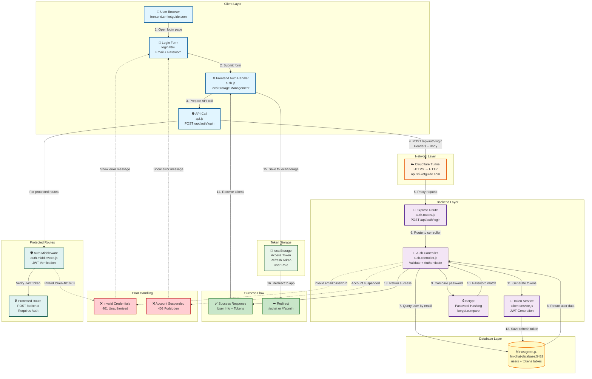

# 🔐 Login System Flow Diagram

แผนภาพแสดงการทำงานของระบบ Login ทั้งหมดตั้งแต่ผู้ใช้เปิดหน้า login จนถึงการ redirect ไปยังหน้าแอปพลิเคชัน

## 📊 Deployment Diagram (Mermaid)

## 📋 **ลำดับการทำงาน (Flow Sequence)**

### **Main Login Flow (1-16):**

1. **User opens login page** → User เปิด `frontend.sri-ketguide.com/#/login`
2. **Login form displayed** → แสดงฟอร์ม login (email + password)
3. **User submits form** → User กดปุ่ม "เข้าสู่ระบบ"
4. **Frontend auth handler** → `auth.js` เตรียมข้อมูล
5. **API call prepared** → `api.js` สร้าง `POST /api/auth/login` request
6. **Request sent** → ส่ง request พร้อม `{email, password}` body
7. **Cloudflare Tunnel** → Proxy HTTPS → HTTP ภายใน
8. **Express route** → `auth.routes.js` รับ request → ส่งไป `authController.login`
9. **Auth controller** → ตรวจสอบข้อมูล:
   - Validate input (email, password)
   - Query database: `User.findOne({ where: { email } })`
10. **Database query** → ค้นหา user จาก `users` table
11. **Password verification** → ใช้ `bcrypt.compare(password, password_hash)`
12. **Check suspended** → ตรวจสอบ `user.is_suspended === false`
13. **Generate tokens** → `tokenService.generateTokens({ userId, role })`
   - Access Token: 1 hour expiry
   - Refresh Token: 7 days expiry
14. **Save refresh token** → บันทึก `refresh_token` ใน `tokens` table
15. **Success response** → ส่งกลับ `{ message, user, tokens }`
16. **Save to localStorage** → Frontend เก็บ tokens ใน localStorage:
   - `llm_access_token`
   - `llm_refresh_token`
   - `llm_user_role`
17. **Redirect** → เปลี่ยน route ไปยัง `#/chat` หรือ `#/admin` (ตาม role)

### **Error Handling:**

**Invalid Credentials (401):**
- User ไม่พบ หรือ password ไม่ตรง
- Response: `{ message: 'Invalid email or password' }`
- Frontend แสดง error message

**Account Suspended (403):**
- `user.is_suspended === true`
- Response: `{ message: 'Your account has been suspended' }`
- Frontend แสดง error message

### **Protected Routes Flow:**

เมื่อผู้ใช้เรียก API endpoint ที่ต้องการ authentication:

1. **Request with token** → Frontend ส่ง `Authorization: Bearer <token>` header
2. **Auth middleware** → `auth.middleware.js` ตรวจสอบ:
   - Extract token from header
   - Verify JWT: `jwt.verify(token, JWT_SECRET)`
   - Attach user to `req.user = { userId, role }`
3. **Protected route** → Controller ใช้ `req.user` เพื่อ authorization
4. **Invalid token** → Return 401/403 และ redirect ไปหน้า login

## 🔧 **Components Details**

### **Frontend Components:**
- **login.html**: Login form template
- **auth.js**: Token management functions
- **api.js**: HTTP client สำหรับ API calls
- **localStorage**: Client-side token storage

### **Backend Components:**
- **auth.routes.js**: Express routes (`/register`, `/login`, `/refresh`)
- **auth.controller.js**: Business logic สำหรับ authentication
- **auth.middleware.js**: JWT verification middleware
- **token.service.js**: JWT token generation และ management

### **Database Tables:**
- **users**: `email`, `password_hash`, `role`, `is_suspended`
- **tokens**: `user_id`, `refresh_token`, `created_at`

### **Security Features:**
- ✅ Password hashing ด้วย bcrypt
- ✅ JWT tokens สำหรับ stateless authentication
- ✅ Refresh tokens สำหรับ token renewal
- ✅ Token verification สำหรับ protected routes
- ✅ Account suspension check

---

**หมายเหตุ**: ไฟล์ `loginSystem.drawio` สามารถเปิดได้ด้วย draw.io application สำหรับแก้ไขแผนภาพแบบ visual editor

