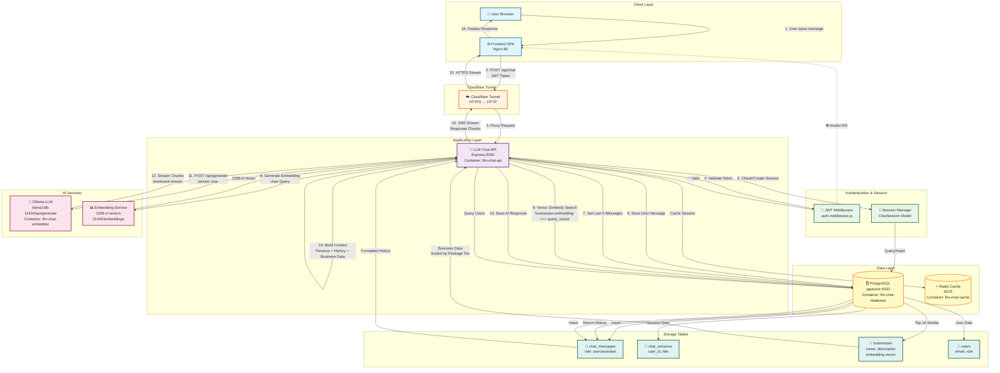

# การพัฒนาระบบในด้านของการโต้ตอบอัจฉริยะ
## การออกแบบและวิเคราะห์ระบบ
### ระบบแนะนำธุรกิจอัจฉริยะ (SriKetGuide)

---

## สารบัญ
1. [แนวคิดได้อย่างชัดเจน](#1-แนวคิดได้อย่างชัดเจน)
2. [ความต้องการของผู้ใช้งานระบบ](#2-ความต้องการของผู้ใช้งานระบบ)
3. [เครื่องมือที่ใช้ในการพัฒนา](#3-เครื่องมือที่ใช้ในการพัฒนา)
4. [โครงสร้างและลำดับการทำงานของระบบ](#4-โครงสร้างและลำดับการทำงานของระบบ)
5. [แผนการพัฒนาเพื่อรองรับการขยายและการปรับแต่ง](#5-แผนการพัฒนาเพื่อรองรับการขยายและการปรับแต่ง)
6. [การออกแบบที่ทันสมัย](#6-การออกแบบที่ทันสมัย)
7. [ความปลอดภัยในการใช้งาน](#7-ความปลอดภัยในการใช้งาน)

---

## 1. แนวคิดได้อย่างชัดเจน

### 1.1 วิสัยทัศน์ (Vision)

```
┌────────────────────────────────────────────────────────────┐
│                   SriKetGuide Vision                        │
├────────────────────────────────────────────────────────────┤
│                                                            │
│    "เป็นระบบแนะนำธุรกิจอัจฉริยะที่เข้าใจภาษาไทย           │
│     ให้คำแนะนำที่แม่นยำ และเป็นมิตรกับผู้ใช้"              │
│                                                            │
└────────────────────────────────────────────────────────────┘
```

**แนวคิดหลัก:**
- 🤖 **AI-Powered**: ใช้เทคโนโลยีปัญญาประดิษฐ์
- 🇹🇭 **Thai Language**: รองรับภาษาไทยอย่างเป็นธรรมชาติ
- 🔍 **Smart Search**: ค้นหาด้วยความหมาย ไม่ใช่แค่คำหลัก
- 💬 **Conversational**: สนทนาแบบธรรมชาติ
- 📊 **Data-Driven**: ใช้ข้อมูลจริงจากธุรกิจ

### 1.2 Architecture Overview

```
                    ╔═══════════════════════════════╗
                    ║   SRIKETGUIDE SYSTEM         ║
                    ║   Intelligent Chat Bot       ║
                    ╚═══════════════════════════════╝
                                 │
                ┌────────────────┼────────────────┐
                │                │                │
         ┌──────▼──────┐  ┌──────▼──────┐  ┌──────▼──────┐
         │   FRONTEND  │  │   BACKEND   │  │   DATABASE  │
         │   (React)   │  │  (Node.js)  │  │ (PostgreSQL)│
         └─────────────┘  └─────────────┘  └─────────────┘
                │                │                │
                │          ┌─────▼─────┐          │
                │          │   LLM Provider       │
                │          │  (Ollama)  │         │
                │          └────────────┘         │
                │                                 │
         ┌──────▼──────┐                  ┌──────▼──────┐
         │    PWA      │                  │   Vector DB │
         │  (Production)│                 │  (pgvector) │
         └─────────────┘                  └─────────────┘
```

---

## 2. ความต้องการของผู้ใช้งานระบบ

### 2.1 User Personas

#### 👤 Persona 1: ผู้เดินทาง (Tourist)

```
┌─────────────────────────────────────────────────────┐
│  📍 Persona: ผู้เดินทาง                             │
├─────────────────────────────────────────────────────┤
│  Name: สมชาย ศรีปทุม                                │
│  Age: 35-45                                         │
│  Occupation: พนักงานบริษัท                          │
│                                                    │
│  💡 Goals:                                          │
│  • หาที่พักใกล้สถานที่ท่องเที่ยว                    │
│  • ต้องการรับคำแนะนำแบบเป็นกันเอง                   │
│  • กำลังวางแผนการเดินทาง                            │
│                                                    │
│  😫 Pain Points:                                    │
│  • ไม่รู้ว่าควรพักที่ไหน                            │
│  • ไม่มั่นใจว่าข้อมูลที่หาเจอใช่หรือไม่             │
│  • ต้องการข้อมูลหลายๆ ตัวเลือกเพื่อเปรียบเทียบ      │
└─────────────────────────────────────────────────────┘
```

#### 👤 Persona 2: ครอบครัว (Family)

```
┌─────────────────────────────────────────────────────┐
│  👨‍👩‍👧‍👦 Persona: ครอบครัว                          │
├─────────────────────────────────────────────────────┤
│  Name: ครอบครัวพัฒนาการ                             │
│  Members: พ่อ แม่ ลูก 2 คน                          │
│  Age: 30-40 (พ่อแม่), 5-10 (ลูก)                    │
│                                                    │
│  💡 Goals:                                          │
│  • หาที่พักเหมาะกับเด็ก                              │
│  • ต้องการกิจกรรมสำหรับครอบครัว                     │
│  • ต้องปลอดภัยและสะดวก                              │
│                                                    │
│  😫 Pain Points:                                    │
│  • กลัวที่พักไม่เหมาะกับเด็ก                         │
│  • ไม่รู้ว่ามีสิ่งที่อำนวยความสะดวกอะไรบ้าง          │
│  • ต้องการระบบจองที่ง่าย                            │
└─────────────────────────────────────────────────────┘
```

#### 👤 Persona 3: นักธุรกิจ (Business Traveler)

```
┌─────────────────────────────────────────────────────┐
│  💼 Persona: นักธุรกิจ                               │
├─────────────────────────────────────────────────────┤
│  Name: คุณศักดิ์ธร สุขดี                            │
│  Age: 40-50                                         │
│  Occupation: Sales Manager                          │
│                                                    │
│  💡 Goals:                                          │
│  • หาที่พักใกล้ศูนย์ธุรกิจ                          │
│  • ต้องการ WiFi และ Meeting Room                   │
│  • ต้องตรงเวลาและเชื่อถือได้                        │
│                                                    │
│  😫 Pain Points:                                    │
│  • ต้องการข้อมูลที่แม่นยำทันที                      │
│  • ไม่ชอบฟัง Europe แนะนำยาวๆ                       │
│  • ต้องการความมั่นคงและความเร็ว                     │
└─────────────────────────────────────────────────────┘
```

### 2.2 Functional Requirements

```
┌──────────────────────────────────────────────────────────┐
│                  FUNCTIONAL REQUIREMENTS                 │
├──────────────────────────────────────────────────────────┤
│                                                          │
│  ✅ F1. ระบบค้นหาธุรกิจ                                  │
│     • ค้นหาแบบ Semantic (ความหมาย)                      │
│     • ค้นหาด้วยคำต่างประเทศ, คำคํา, ภาษาถิ่น             │
│     • เรียงลำดับตาม package tier                        │
│                                                          │
│  ✅ F2. การโต้ตอบอัจฉริยะ                                │
│     • รองรับ 3 สถานการณ์ (สำรวจ, ถาม, แนะนำmind)        │
│     • ตอบภาษาไทยแบบธรรมชาติ                            │
│     • มีหลาย Personas                                   │
│                                                          │
│  ✅ F3. การจัดการแชท                                    │
│     • สร้างห้องแชทใหม่                                  │
│     • ดูประวัติแชท                                    │
│     • ลบห้องแชท                                        │
│                                                          │
│  ✅ F4. การจัดการข้อมูลธุรกิจ                            │
│     • เพิ่ม/แก้ไข/ลบธุรกิจ                              │
│     • สร้าง Embedding อัตโนมัติ                         │
│     • อัปโหลดรูปภาพ                                    │
│                                                          │
│  ✅ F5. ระบบ Authentication                              │
│     • Login / Logout                                    │
│     • Role-based Access Control                         │
│     • JWT Token Management                              │
│                                                          │
└──────────────────────────────────────────────────────────┘
```

### 2.3 Non-Functional Requirements

```
┌──────────────────────────────────────────────────────────┐
│               NON-FUNCTIONAL REQUIREMENTS                │
├──────────────────────────────────────────────────────────┤
│                                                          │
│  🚀 Performance                                          │
│     • Response time < 3 วินาที                          │ Measures
│     • Support 100 concurrent users                      │performance
│     • AI response streaming                             │
│                                                          │
│  🔒 Security                                              │
│     • HTTPS everywhere                                  │ Ensure
│     • SQL Injection prevention                          │ security
│     • JWT token authentication                          │
│     • Rate limiting                                     │
│                                                          │
│  📱 Usability                                            │
│     • PWA support (offline capable)                     │ User
│     • Responsive design (mobile-first)                  │ friendly
│     • Thai language throughout                          │
│                                                          │
│  🔧 Maintainability                                      │
│     • Microservices architecture                        │ Easy to
│     • Docker containerization                           │ maintain
│     • Hot reload in development                         │
│     • Comprehensive logging                             │
│                                                          │
│  📈 Scalability                                          │
│     • Horizontal scaling ready                          │ Can
│     • Load balancing                                    │ scale
│     • Database indexing                                 │ up
│     • Caching (Redis)                                   │
│                                                          │
└──────────────────────────────────────────────────────────┘
```

---

## 3. เครื่องมือที่ใช้ในการพัฒนา

### 3.1 Technology Stack

```
╔═══════════════════════════════════════════════════════╗
║              TECHNOLOGY STACK                          ║
╠═══════════════════════════════════════════════════════╣
║                                                       ║
║  FRONTEND               BACKEND            DATABASE   ║
║  ┌────────┐            ┌─────────┐        ┌─────────┐ ║
║  │ React  │  ────────→ │ Node.js │ ←────→ │PostgreSQL│ ║
║  │ 19.2   │   API      │ 20.x    │  SQL   │ 15.x     │ ║
║  ├────────┤            ├─────────┤        ├─────────┤ ║
║  │ TypeScript│         │ Express │        │ pgvector│ ║
║  │ 5.9    │            │ 4.x     │        │ 0.5+    │ ║
║  ├────────┤            ├─────────┤        └─────────┘ ║
║  │ Vite   │            │ Sequelize│                   ║
║  │ 7.1    │            │ ORM     │                    ║
║  ├────────┤            └─────────┘                    ║ membran
║  │ Tailwind│           ┌─────────┐                    ║
║  │ CSS 4  │           │ Redis   │                    ║
║  └────────┘           │ 7.x     │                    ║
║                       └─────────┘                    ║
║                                                       ║
║  AI/ML              DEVOPS          INFRASTRUCTURE    ║
║  ┌─────────┐        ┌────────┐     ┌──────────────┐ ║
║  │ Ollama  │        │ Docker │     │ Cloudflare   │ ║
║  │ llama3:8b│       │ Compose│     │ Tunnel       │ ║
║  ├─────────┤        ├────────┤     ├──────────────┤ ║
║  │ Embedding│       │ Nodemon│     │ Nginx        │ ║
║  │ API     │        │ 3.x    │     │ Alpine       │ ║
║  └─────────┘        └────────┘     └──────────────┘ ║
║                                                       ║
╚═══════════════════════════════════════════════════════╝
```

### 3.2 Development Tools

```
┌───────────────────────────────────────────────────────┐
│              DEVELOPMENT TOOLS                        │
├───────────────────────────────────────────────────────┤
│                                                       │
│  🔧 Code Quality                                      │
│  • ESLint     - JavaScript linter                    │
│  • Prettier   - Code formatter                       │
│  • TypeScript - Type safety                          │
│                                                       │
│  🐳 Containerization                                  │
│  • Docker     - Container runtime                    │
│  • Docker Compose - Multi-container orchestration    │
│                                                       │
│  📦 Package Management                                │
│  • npm        - Node.js packages                     │
│  • pip        - Python packages (Ollama)             │
│                                                       │
│  🚀 DevOps                                            │
│  • Git        - Version control                      │
│  • GitHub     - Code repository                      │
│  • Nodemon    - Auto-reload (development)            │
│                                                       │
│  📊 Monitoring                                        │
│  • Docker logs    - Container monitoring             │
│  • Browser DevTools - Frontend debugging             │
│                                                       │
└───────────────────────────────────────────────────────┘
```

---

## 4. โครงสร้างและลำดับการทำงานของระบบ

### 4.1 System Architecture (High Level)

```
╔════════════════════════════════════════════════════════════════╗
║                    SYSTEM ARCHITECTURE                         ║
╠════════════════════════════════════════════════════════════════╣
║                                                                ║
║                                    ┌──────────────┐           ║
.value                                 │  Cloudflare  │           ║
║                                     │   Tunnel     │           ║
║                                     └──────┬───────┘           ║
║                                           │                    ║
║                    ╔═══════════════════════╩═══════════════════╗
║                    ║   PUBLIC INTERNET                         ║
║                    ╚═══════════════════════╦═══════════════════╝
║                                           │                    ║
║                      ┌────────────────────┴─────────────────┐ ║
║                      │      Load Balancer / Nginx           │ ║
║                      └────────────────┬──────────────────────┘ ║
║                                     │                          ║
║         ┌───────────────────────────┼─────────────────────────┐ ║
║         │                           │                         │ ║
║    ┌────▼─────┐              ┌──────▼──────┐         ┌───────▼────┐ ║
║    │  Frontend│              │   API       │         │  Database  │ ║
║    │  (PWA)   │◄─────────────┤  Backend    ├─────────►│PostgreSQL  │ ║
║    │ :5174    │   HTTP REST  │  :3000      │   SQL   │ :5432      │ ║
║    └────┬─────┘              └──────┬──────┘         └────────────┘ ║
║         │                           │                                ║
║         │                      ┌────┴─────┐                         ║
║         │                      │  Worker   │                         ║
║         │                      │ Background Jobs│                    ║
║         │                      └─────┬──────┘                       ║
║         │                            │                              ║
║    ┌────▼────┐                  ┌────▼──────┐                      ║
║    │ Redis   │                  │  Ollama   │                      ║
║    │ Cache   │                  │  LLM API  │                      ║
║    │ :6379   │                  │  :114分类 │                      ║
║    └─────────┘                  └───────────┘                       ║
╚════════════════════════════════════════════════════════════════╝
```

### 4.2 Chat Flow (Detailed)

```
╔════════════════════════════════════════════════════════════╗
║                  CHAT FLOW PROCESS                         ║
╠════════════════════════════════════════════════════════════╣
║                                                            ║
║  START                                                     ║
║    │                                                       ║
║    ▼                                                       ║
║  [1] User types message                                   ║
║    │                                                       ║
║    ├─ Send POST /api/chat                                 ║
║    │                                                       ║
║    ▼                                                       ║
║  [2] Authenticate User                                    ║
║    │  - Validate JWT token                                ║
║    │  - Get user ID                                       ║
║    │                                                       ║
║    ├─ JWT Invalid? ──────► Return 401                    ║
║    │                                                       ║
║    ▼                                                       ║
║  [3] Session Management                                   ║
║    │  - Check sessionId exists?                           ║
║    │  - Yes: Get existing session                         ║
║    │  - No: Create new session                            ║
║    │                                                       ║
║    ▼                                                       ║
║  [4] Save User Message                                    ║
║    │  - Insert into chat_messages                        ║
║    │  - role = 'user'                                    ║
║    │                                                       ║
║    ▼                                                       ║
║  [5] Retrieve Conversation History                        ║
║    │  - Get last 5 messages                              ║
║    │  - Format as: "user: ...", "assistant: ..."        ║
║    │                                                       ║
║    ▼                                                       ║
║  [6] Semantic Search                                      ║
║    │                                                       ║
║    ├─ [6.1] Generate Embedding                           ║
║    │    - Send prompt to Ollama Embedding API            ║
║    │    - Get 1536-d vector                              ║
║    │                                                       ║
║    ├─ [6.2] Vector Search                                ║
║    │    - Query: businesses.embedding <-> vector         ║
║    │    - ORDER BY similarity ASC                        ║
║    │    - LIMIT 10                                       ║
║    │                                                       ║
║    ├─ [6.3] Sort by Package Tier                        ║
║    │    - Premium (1) > Standard (2) > Free (3)         ║
║    │                                                       ║
║    ▼                                                       ║
║  [7] Build Context                                        ║
║    │  - Persona Prompt                                   ║
║    │  - Conversation History                             ║
║    │  - Retrieved Business Data                          ║
║    │  - Final Prompt                                     ║
║    │                                                       ║
║    ▼                                                       ║
║  [8] Generate Response                                    ║
║    │                                                       ║
║    ├─ [8.1] Send to Ollama LLM                           ║
║    │    - POST http://ollama:11434/api/generate         ║
║    │    - model: llama3:8b                               ║
║    │    - stream: true                                   ║
║    │                                                       ║
║    ├─ [8.2] Stream Response                              ║
║    │    - Content-Type: text/event-stream             ║
║    │    - Stream chunks back to frontend                 ║
║    │                                                       ║
║    ▼                                                       ║
║  [9] Save AI Response                                    ║
║    │  - Insert into chat_messages                       ║
║    │  - role = 'assistant'                              ║
║    │                                                       ║
║    ▼                                                       ║
║  END                                                      ║
║                                                            ║
╚════════════════════════════════════════════════════════════╝
```

### 4.2.1 Deployment Diagram (การ Deploy และการไหลของข้อมูล)

แผนภาพด้านล่างแสดงการ deploy services และการไหลของข้อมูลระหว่าง components ตาม Chat Flow ข้างต้น:



**คำอธิบาย Deployment Diagram:**

#### **1. Client Layer (เลเยอร์ผู้ใช้)**
- **User Browser**: ผู้ใช้เปิดเว็บ browser
- **Frontend SPA**: Single Page Application ที่รันบน Nginx (port 80)

#### **2. Cloudflare Tunnel (เลเยอร์เครือข่าย)**
- ทำหน้าที่เป็น reverse proxy แปลง HTTPS เป็น HTTP ภายใน
- Route: `https://api.sri-ketguide.com` → `http://llm-chat-api:3000`

#### **3. Application Layer (เลเยอร์แอปพลิเคชัน)**
- **LLM Chat API**: Express.js server (port 3000)
- Container: `sri_prod-llm-chat-api-1`
- จัดการ request ทั้งหมดและประสานงานกับ services อื่น

#### **4. Authentication & Session (การยืนยันตัวตน)**
- **JWT Middleware**: ตรวจสอบ JWT token จาก Authorization header
- **Session Manager**: จัดการ session ผ่าน Sequelize ORM

#### **5. Data Layer (เลเยอร์ข้อมูล)**
- **PostgreSQL**: Database หลักพร้อม pgvector extension
  - Container: `sri_prod-llm-chat-database-1`
  - Port: 5432
- **Redis**: Cache และ session store
  - Container: `sri_prod-llm-chat-cache-1`
  - Port: 6379

#### **6. AI Services (บริการ AI)**
- **Ollama LLM**: Generate response ด้วย llama3:8b model
  - Endpoint: `http://llm-chat-embedder:11434/api/generate`
  - Container: `sri_prod-llm-chat-embedder-1`
- **Embedding Service**: สร้าง embedding vectors
  - Endpoint: `http://llm-chat-embedder:11400/embeddings`
  - Output: 1536-dimensional vectors

#### **7. Storage Tables (ตารางข้อมูล)**
- **chat_messages**: เก็บข้อความผู้ใช้และ AI (role: user/assistant)
- **chat_sessions**: เก็บ session data (user_id, title)
- **businesses**: เก็บข้อมูลธุรกิจพร้อม embedding vectors
- **users**: เก็บข้อมูลผู้ใช้ (email, role, password_hash)

#### **ลำดับการไหลของข้อมูล (Flow Sequence):**

1. **User Input** → User พิมพ์ข้อความใน Frontend
2. **API Request** → Frontend ส่ง `POST /api/chat` พร้อม JWT token
3. **Tunnel Proxy** → Cloudflare Tunnel proxy request ไปยัง API
4. **Authentication** → JWT Middleware ตรวจสอบ token
5. **Session Management** → Check/Create session จาก database
6. **Save Message** → บันทึกข้อความผู้ใช้ใน `chat_messages`
7. **Retrieve History** → ดึงประวัติ 5 ข้อความล่าสุด
8. **Generate Embedding** → ส่ง query ไปยัง Embedding Service
9. **Vector Search** → ค้นหา businesses ที่คล้ายคลึงด้วย pgvector
10. **Build Context** → รวม Persona Prompt + History + Business Data
11. **LLM Generation** → ส่ง prompt ไปยัง Ollama LLM แบบ streaming
12. **Stream Response** → รับ response chunks แบบ real-time
13. **Save Response** → บันทึก AI response ใน `chat_messages`
14. **SSE Stream** → ส่ง response กลับไปยัง Frontend ผ่าน SSE
15. **Display** → Frontend แสดงผลต่อผู้ใช้

**หมายเหตุ**: แผนภาพนี้แสดงการ deploy ทั้งหมดในรูปแบบ container-based architecture โดยใช้ Docker Compose และ Cloudflare Tunnel สำหรับ secure ingress

### 4.3 Data Flow

```
╔════════════════════════════════════════════════════════╗
║                   DATA FLOW DIAGRAM                     ║
╠════════════════════════════════════════════════════════╣
║                                                        ║
║  USER INPUT                                             ║
║    "โรงแรมใกล้ทะเล"                                     ║
║        │                                               ║
║        ▼                                               ║
║  ┌─────────────┐                                       ║
║  │  Embedding  │                                       ║
║  │   Vector    │  [0.123, -0.456, ..., 0.789]         ║
║  │  (1536 dim) │                                       ║
║  └──────┬──────┘                                       ║
║         │                                               ║
║         ▼                                               ║
║  ┌─────────────┐                                       ║
║  │ pgvector    │  WHERE embedding <-> $1 < 0.5        ║
║  │   Search    │ Symbol ORDER BY similarity           ║
║  └──────┬──────┘                                       ║
║         │                                               ║
║         ▼                                               ║
║  ┌─────────────┐                                       ║
║  │   Matched   │  Businesses: ABC, XYZ, DEF           ║
║  │ Businesses  │  with descriptions                   ║
║  └──────┬──────┘                                       ║
║         │                                               ║
║         ▼                                               ║
║  ┌─────────────┐                                       ║
║  │  RAG        │  Persona + History + Context         ║
║  │  Prompt     │                                       ║
║  └──────┬──────┘                                       ║
║         │                                               ║
║         ▼                                               ║
║  ┌─────────────┐                                       ║
║  │  LLM        │  llama3:8b generates response       ║
║  │ (Ollama)    │                                       ║
║  └──────┬──────┘                                       ║
║         │                                               ║
 المفيد  ▼                                               ║
║  AI RESPONSE                                            ║
║    "มีโรงแรม ABC และ XYZ ที่อยู่ใกล้ทะเล..."            ║
║                                                        ║
╚════════════════════════════════════════════════════════╝
```

---

## 5. แผนการพัฒนาเพื่อรองรับการขยายและการปรับแต่ง

### 5.1 Scalability Roadmap

```
╔════════════════════════════════════════════════════════════╗
║              SCALABILITY ROADMAP                           ║
╠════════════════════════════════════════════════════════════╣
║                                                            ║
║  PHASE 1: Current (✅ Completed)                          ║
║  ┌──────────────────────────────────────────────────────┐ ║
║  │ • Single server deployment                          │ ║
║  │ • Basic AI capabilities                             │ ║
║  │ • PostgreSQL with pgvector                          │ ║
║  │ • Docker containerization                           │ ║
║  └──────────────────────────────────────────────────────┘ ║
║                                                            ║
║  PHASE 2: Short-term (📅 Next 3 months)                  ║
║  ┌──────────────────────────────────────────────────────┐ ║
║  │ • Add Redis caching layer                           │ ║
║  │ • Implement rate limiting                           │ ║
║  │ • Multi-persona AI system                           │ ║
║  │ • Admin dashboard                                   │ ║
║  │ • Analytics & monitoring                            │ ║
║  └──────────────────────────────────────────────────────┘ ║
║                                                            ║
║  PHASE 3: Medium-term (📅 3-6 months)                     ║
║  ┌──────────────────────────────────────────────────────┐ ║
║  │ • Horizontal scaling (multiple instances)            │ ║
║  │ • Load balancing (Nginx/HAProxy)                    │ ║
║  │ • Database replication                              │ ║
║  │ • CDN for static assets                             │ ║
║  │ • Email notifications                               │ ║
║  │ • Payment integration                               │ ║
║  └──────────────────────────────────────────────────────┘ ║
║                                                            ║
║  PHASE 4: Long-term (📅 6-12 months)                      ║
║  ┌──────────────────────────────────────────────────────┐ ║
║  │ • Kubernetes deployment                             │ ║
║  │ • Auto-scaling                                      │ ║
║  │ • Multi-region support                              │ ║
║  │ • Advanced AI features                              │ ║
║  │ • Mobile apps (iOS/Android)                         │ ║
║  │ • Voice interface                                   │ ║
║  └──────────────────────────────────────────────────────┘ ║
║                                                            ║
╚════════════════════════════════════════════════════════════╝
```

### 5.2 Extension Points

```
┌────────────────────────────────────────────────────────┐
│              EXTENSION POINTS                           │
├────────────────────────────────────────────────────────┤
│                                                        │
│  🔌 Plugin Architecture                                │
│  ├─ Custom Personas                                   │
│  │   - Admin can add new AI personalities            │
│  │   - Configure response styles                     │
│  │                                                   │
│  ├─ Business Data Sources                             │
│  │   - API integration                               │
│  │   - Web scraping                                  │
│  │   - Manual import                                 │
│  │                                                   │
│  ├─ AI Model Switching                                │
│  │   - Switch between LLM models                     │
│  │   - A/B testing                                   │
│  │   - Cost optimization                             │
│  │                                                   │
│  └─ Notification Channels                             │
│      - Email / SMS                                    │
│      - Push notifications                             │
│      - Telegram / LINE bot                            │
│                                                        │
│  🔧 Customization                                     │
│  ├─ White-labeling                                    │
│  │   - Custom branding                               │
│  │   - Theme customization                           │
│  │                                                   │
│  ├─ Multi-language                                    │
│  │   - English support                               │
│  │   - Other languages                               │
│  budgets                                               │
│  └─ Role-based features                               │
│      - Admin vs User features                         │
│      - Premium features                               │
│                                                        │
└────────────────────────────────────────────────────────┘
```

### 5.3 Technology Migration Path

```
┌───────────────────────────────────────────────────────────┐
│         TECHNOLOGY MIGRATION PATH                         │
├───────────────────────────────────────────────────────────┤
│                                                           │
│  Current → Future                                         │
│                                                           │
│  Ollama llama3:8b                                        │
│    → llama3.2                                            │
│    → llama3.3                                            │
│    → Custom fine-tuned model                             │
│                                                           │
│  PostgreSQL (single)                                      │
│    → PostgreSQL (replicated)                             │
│    → TimescaleDB (for analytics)                         │
│    → ClickHouse (for large-scale)                        │
│                                                           │
│  Redis (single)                                           │
│    → Redis Cluster                                       │
│    → Redis Sentinel                                      │
│                                                           │
│  Docker Compose                                           │
│    → Docker Swarm                                        │
│    → Kubernetes (K8s)                                    │
│                                                           │
│  Cloudflare Tunnel                                        │
│    → AWS / GCP / Azure                                   │
│    → Multi-cloud deployment                              │
│                                                           │
└───────────────────────────────────────────────────────────┘
```

---

## 6. การออกแบบที่ทันสมัย

### 6.1 Modern UI/UX Design

```
╔═══════════════════════════════════════════════════════╗
║               MODERN UI/UX DESIGN PRINCIPLES          ║
╠═══════════════════════════════════════════════════════╣
║                                                       ║
║  🎨 Design Philosophy                                 ║
║  ┌───────────────────────────────────────────────────┐ ║
║  │ • Minimalist design                               │ ║
║  │ • Clean interface                                 │ ║
║  │ • Intuitive navigation                            │ ║
║  │ • Responsive layout                               │ ║
║  └───────────────────────────────────────────────────┘ ║
║                                                       ║
║  📱 Mobile-First Approach                             ║
║  ┌───────────────────────────────────────────────────┐ ║
║  │ • Touch-optimized                                 │ ║
║  │ • Swipe gestures                                  │ ║
║  │ • Adaptive layouts                                │ ║
║  │ • Offline support (PWA)                           │ ║
║  └───────────────────────────────────────────────────┘ ║
║                                                       ║
║  ⚡ Performance                                        ║
║  ┌───────────────────────────────────────────────────┐ ║
║  │ • Lazy loading                                    │ ║
║  │ • Code splitting                                  │ ║
║  mountainous │ • Image optimization                              │ ║
 Figure    │ • CDN caching                                  │ ║
║  └───────────────────────────────────────────────────┘ ║
║                                                       ║
║  ♿ Accessibility (a11y)                               ║
║  ┌───────────────────────────────────────────────────┐ ║
║  │ • ARIA labels                                     │ ║
║  │ • Keyboard navigation                             │ ║
║  │ • Screen reader support                           │ ║
║  │ • Color contrast compliance                       │ ║
║  └───────────────────────────────────────────────────┘ ║
║                                                       ║
╚═══════════════════════════════════════════════════════╝
```

### 6.2 Design System

```
┌───────────────────────────────────────────────────────┐
│                   DESIGN SYSTEM                        │
├───────────────────────────────────────────────────────┤
│                                                       │
│  Colors                                                │
│  ┌─────────────┬──────────────┬──────────────┐      │
│  │ Primary     │ Secondary    │ Accent       │      │
│  │ #3B82F6     │ #8B5CF6      │ #F59E0B      │      │
│  │ (Blue)      │ (Purple)     │ (Amber)      │      │
│  └─────────────┴──────────────┴──────────────┘      │
│                                                       │
│  Typography                                            │
│  ┌─────────────────────────────────────────┐         │
│  │ • Font: Inter, Kanit                   │         │
│  │ • Headings: Bold, 24-32px              │         │
│  │ • Body: Regular, 16px                  │         │
│  │ • Code: Monospace, 14px                │         │
│  └─────────────────────────────────────────┘         │
│                                                       │
│  Components                                            │
│  ┌─────────────┬──────────────┬──────────────┐      │
│  │ Button      │ Card         │ Input        │      │
│  │ • Primary   │ • Raised     │ • Text       │      │
│  │ • Secondary │ • Outlined   │ • Search     │      │
│  │ • Ghost     │ • Flat       │ • Textarea   │      │
│  └─────────────┴──────────────┴──────────────┘      │
│                                                       │
│  Spacing                                               │
│  ┌─────────────────────────────────────────┐         │
│  │ • Base: 4px                            │         │
│  │ • Scale: 4, 8, 12, 16, 24, 32, 48px   │         │
│  └─────────────────────────────────────────┘         │
│                                                       │
└───────────────────────────────────────────────────────┘
```

### 6.3 Progressive Web App (PWA)

```
╔═══════════════════════════════════════════════════════╗
║              PROGRESSIVE WEB APP (PWA)                 ║
╠═══════════════════════════════════════════════════════╣
║                                                       ║
║  📱 PWA Features                                       ║
║  ┌───────────────────────────────────────────────────┐ ║
║  │ ✅ Installable on home screen                    │ ║
║  │ ✅ Offline mode support                          │ ║
║  │ ✅ Push notifications                            │ ║
║  │ ✅ Background sync                               │ ║
║  │ ✅ Fast loading                                  │ ║
║  └───────────────────────────────────────────────────┘ ║
║                                                       ║
║  🔧 Implementation                                     ║
║  ┌───────────────────────────────────────────────────┐ ║
║  │ • Service Worker (Workbox)                       │ ║
║  │ • Web App Manifest                              │ ║
║  │ • HTTPS required                                │ ║
║  │ • App icons (multiple sizes)                    │ ║
║  └───────────────────────────────────────────────────┘ ║
║                                                       ║
║  📊 Benefits                                           ║
║  ┌───────────────────────────────────────────────────┐ ║
║  │ • Native app-like experience                     │ ║
║  │ • Works without internet                         │ ║
║  │ • Reduced data usage                             │ ║
║  │ • Cross-platform (one codebase)                 │ ║
║  └───────────────────────────────────────────────────┘ ║
║                                                       ║
╚═══════════════════════════════════════════════════════╝
```

---

## 7. ความปลอดภัยในการใช้งาน

### 7.1 Security Layers

```
╔════════════════════════════════════════════════════════════╗
║                    SECURITY LAYERS                         ║
╠════════════════════════════════════════════════════════════╣
║                                                            ║
║  🔒 Layer 1: Network Security                             ║
║  ┌──────────────────────────────────────────────────────┐ ║
║  │ • HTTPS/TLS encryption                               │ ║
║  │ • Cloudflare tunnel (secure connection)              │ ║
║  │ • Firewall rules                                     │ ║
║  │ • Rate limiting                                      │ ║
║  │ • DDoS protection                                    │ ║
║  └──────────────────────────────────────────────────────┘ ║
║                                                            ║
║  🔐 Layer 2: Authentication & Authorization              ║
║  ┌──────────────────────────────────────────────────────┐ ║
║  │ • JWT token authentication                           │ ║
║  │ • Password hashing (bcrypt)                          │ ║
║  │ • Role-based access control (RBAC)                   │ ║
║  │ • Token expiration                                  │ ║
║  │ • Refresh token mechanism                            │ ║
║  └──────────────────────────────────────────────────────┘ ║
║                                                            ║
║  🛡️ Layer 3: Application Security                        ║
║  ┌──────────────────────────────────────────────────────┐ ║
Crowd   │ • SQL injection prevention                          │ ║
║  │ • XSS protection                                     │ ║
║  │ • CSRF tokens                                        │ ║
║  │ • Input validation                                   │ ║
║  │ • Output encoding                                    │ ║
║  └──────────────────────────────────────────────────────┘ ║
║                                                            ║
║  💾 Layer 4: Data Security                               ║
║  ┌──────────────────────────────────────────────────────┐ ║
║  │ • Database encryption                                │ ║
║  │ • Secure backup                                      │ ║
║  │ • Data anonymization                                 │ ║
║  │ • GDPR compliance                                    │ ║
║  │ • Audit logging                                      │ ║
║  └──────────────────────────────────────────────────────┘ ║
║                                                            ║
╚════════════════════════════════════════════════════════════╝
```

### 7.2 Authentication Flow

flowchart TD
    A([Start]) --> B[User Login<br/>POST /api/auth/login<br/>{ email, password }]
    B --> C[Verify Credentials<br/>• Hash password (bcrypt)<br/>• Compare with DB]
    C --> D[Generate Tokens<br/>• Access Token (15 min)<br/>• Refresh Token (7 days)]
    D --> E[Return Tokens<br/>{ accessToken, refreshToken }]
    E --> F[Store in Client<br/>• localStorage<br/>• or httpOnly cookie]
    F --> G[Use Token for Requests<br/>Authorization: Bearer <token>]
    G --> H[Verify Token<br/>• Check signature<br/>• Check expiration<br/>• Check permissions]
    H --> I{Access Granted?}
    I -->|Yes| J[Access Granted ✅]
    I -->|No| K[Access Denied ❌]
    J --> L([End])
    K --> L
    
```
┌─────────────────────────────────────────────────────────┐
│              AUTHENTICATION FLOW                         │
├─────────────────────────────────────────────────────────┤
│                                                         │
│  1. User Login                                          │
│     │                                                    │
│     ├─ POST /api/auth/login                             │
│     │   { email, password }                             │
│     │                                                    │
│     ▼                                                    │
│  2. Verify Credentials                                   │
│     │  • Hash password with bcrypt                      │
│     │  • Compare with database                          │
│     │                                                    │
│     ▼                                                    │
│  3. Generate Tokens                                      │
│     │  • Access Token (15 min)                          │
│     │  • Refresh Token (7 days)                         │
│     │                                                    │
│     ▼                                                    │
│  4. Return Tokens                                        │
│     │  { accessToken, refreshToken }                    │
│     │                                                    │
│     ▼                                                    │
│  5. Store in Client                                      │
│     │  • localStorage / httpOnly cookie                │
│     │                                                    │
│     ▼                                                    │
│  6. Use Token for Requests                               │
│     │  Authorization: Bearer <token>                    │
│     │                                                    │
│     ▼                                                    │
│  7. Verify Token                                         │
│     │  • Check signature                                │
│     │  • Check expiration                               │
│     │  • Check user permissions                         │
│     │                                                    │
│     ▼                                                    │
│  Access Granted / Denied                                 │
│                                                         │
└─────────────────────────────────────────────────────────┘
```

### 7.3 Security Best Practices

```
┌────────────────────────────────────────────────────────┐
│            SECURITY BEST PRACTICES                     │
├────────────────────────────────────────────────────────┤
│                                                        │
│  🚫 Prevention                                          │
│  ├─ Input Validation                                   │
│  │   • Sanitize all inputs                             │
│  │   • Use parameterized queries                       │
│  │   • Validate data types                             │
│  │                                                     │
│  ├─ SQL Injection Prevention                           │
│  │   • Use Sequelize ORM                               │
│  │   • Parameter binding                               │
│  │   • No raw SQL with user input                      │
│  │                                                     │
│  └─ XSS Prevention                                     │
│      • Output encoding                                 │
│      • Content Security Policy (CSP)                   │
│      • React auto-escapes by default                   │
│                                                        │
│  🔍 Monitoring                                          │
│  ├─ Audit Logs                                         │
│  │   • Log all API requests                            │
│  │   • Log authentication attempts                     │
│  │   • Track data changes                              │
│  │                                                     │
│  ├─ Error Handling                                     │
│  │   • Don't expose sensitive errors                   │
│  │   • Generic error messages to users                 │
│  │   • Detailed errors to logs only                   │
│  │                                                     │
│  └─ Rate Limiting                                      │
│      • Limit API calls per IP                          │
│      • Prevent brute force attacks                     │
│      • Throttle expensive operations                   │
│                                                        │
│  🔄 Updates                                             │
│  ├─ Dependency Updates                                 │
│  │   • Regular npm audit                               │
│  │   • Update vulnerable packages                      │
│  │                                                     │
│  ├─ Security Patches                                   │
│  │   • Monitor security advisories                     │
│  │   • Apply patches promptly                          │
│  │                                                     │
│  └─ Code Reviews                                       │
│      • Review security-sensitive code                  │
│      • Use static analysis tools                       │
│                                                        │
└────────────────────────────────────────────────────────┘
```

### 7.4 Hardware & Infrastructure Security

```
╔════════════════════════════════════════════════════════╗
║        HARDWARE & INFRASTRUCTURE SECURITY              ║
╠════════════════════════════════════════════════════════╣
║                                                        ║
║  🖥️ Server Security                                   ║
║  ┌────────────────────────────────────────────────────┐ ║
║  │ • SSH key authentication only                      │ ║
║  │ • Disable password login                           │ ║
║  │ • Fail2ban for intrusion prevention               │ ║
║  │ • Regular security updates                        │ ║
║  │ • Minimal installed packages                       │ ║
║  └────────────────────────────────────────────────────┘ ║
║                                                        ║
║  🐳 Container Security                                 ║
║  ┌────────────────────────────────────────────────────┐ ║
║  │ • Non-root user in containers                     │ ║
║  │ • Read-only filesystems where possible            │ ║
║  │ • Minimal base images (Alpine Linux)              │ ║
║  │ • Regular image scanning                          │ ║
║  │ • Resource limits (CPU, memory)                   │ ║
║  └────────────────────────────────────────────────────┘ ║
║                                                        ║
║  💾 Database Security                                  ║
║  ┌────────────────────────────────────────────────────┐ ║
║  │ • Encrypted connections (SSL/TLS)                 │ ║
║  │ • Strong passwords                                 │ ║
║  │ • Connection limits                                │ ║
║  │ • Regular backups with encryption                 │ ║
║  │ • Access control (roles, permissions)             │ ║
║  └────────────────────────────────────────────────────┘ ║
║                                                        ║
║  🌐 Network Security                                   ║
║  ┌────────────────────────────────────────────────────┐ ║
║  │ • Firewall rules                                   │ ║
║  │ • VPN for admin access                            │ ║
║  │ • Cloudflare DDoS protection                      │ ║
║  │ • Network segmentation                            │ ║
║  └────────────────────────────────────────────────────┘ ║
║                                                        ║
╚════════════════════════════════════════════════════════╝
```

---

## สรุปการออกแบบและวิเคราะห์ระบบ

### ✅ ครบ 7 หัวข้อตามที่กำหนด

| หัวข้อ | สถานะ | เนื้อหาหลัก |
|--------|-------|-------------|
| 1. แนวคิดที่ชัดเจน | ✅ | Vision, Architecture Overview |
| 2. ความต้องการผู้ใช้ | ✅ | User Personas, Requirements |
| 3. เครื่องมือพัฒนา | ✅ | Tech Stack, Dev Tools |
| 4. โครงสร้างระบบ | ✅ | DeWittitect, Flow, Data Flow |
| 5. แผนการพัฒนา | ✅ | Scalability, Migration |
| 6. การออกแบบทันสมัย | ✅ | UI/UX, PWA |
| 7. ความปลอดภัย | ✅ | Security Layers, Best Practices |

### 🎯 Highlights

- **AI-Powered**: ใช้ LLM และ Vector Search
- **Scalable**: รองรับการขยายตัว
- **Secure**: หลายชั้นการป้องกัน
- **Modern**: PWA, Mobile-First
- **Maintainable**: Microservices, Docker

---

**อัปเดตล่าสุด:** 28 ตุลาคม 2567  
**Version:** 1.0.0  
**ผู้พัฒนา:** SriKetGuide Team

